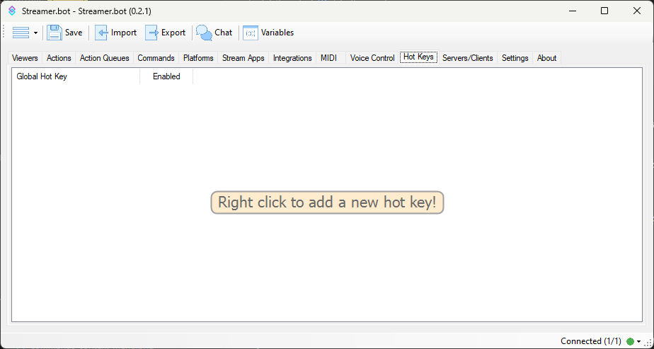

## Overview
The Hot Keys tab allows you to configure global keyboard shortcuts to trigger specific [actions](/guide/actions).

::callout{icon=i-mdi-lightbulb color=amber}
If you instead wish to simulate keystrokes from Streamer.bot, check out the  the [Keyboard Press](/api/sub-actions/general/core/keyboard-press) sub-action.
::

To create your first hot key, <kbd>Right-Click</kbd> in the hot key pane and select `Add` to open the configuration dialog

## Configuration

::field-group
  ::field{name=Key type=Select required}
  Select the key
  ::

  ::field{name=Modifiers type=Toggle required}
    Assign one or more modifiers to your selected hot key

    ::callout{icon=i-mdi-lightbulb color=amber}
    Left and right versions of keys, such as <kbd>LShift</kbd> and <kbd>RShift</kbd>, are **always treated the same**
    ::
  ::

  ::field{name=Group type=Text}
  Optionally type or select a group for this hot key
  ::

  ::field{name=Enabled type=Toggle}
    Toggle this hot key on or off

    ::callout{icon=i-mdi-alert color=amber}
    Once a `Hot Key` has been defined, even when disabled, it will make the selected key combination **unavailable to all other applications** while Streamer.bot is running.
    ::
  ::
::

## Context Menu

<kbd>Right-Click</kbd> any existing hot key to reveal the context menu.

Options are outlined below:

#### `Add`
Create a new hot key

#### `Edit`
Open the hot key configuration dialog

This is the same as <kbd>Double-Clicking</kbd> the entry

#### `Delete`
Delete the selected hot key and free up the configured key combination for other applications

#### `Group`
Quickly assign the hot key to another group

#### `Enabled`
Quickly toggle the selected hot key on or off

## Assign an Action
You can assign any configured hot keys to your actions using the [Hot Key Press Trigger](/api/triggers/general/core/hot-keys/hotkey-press)