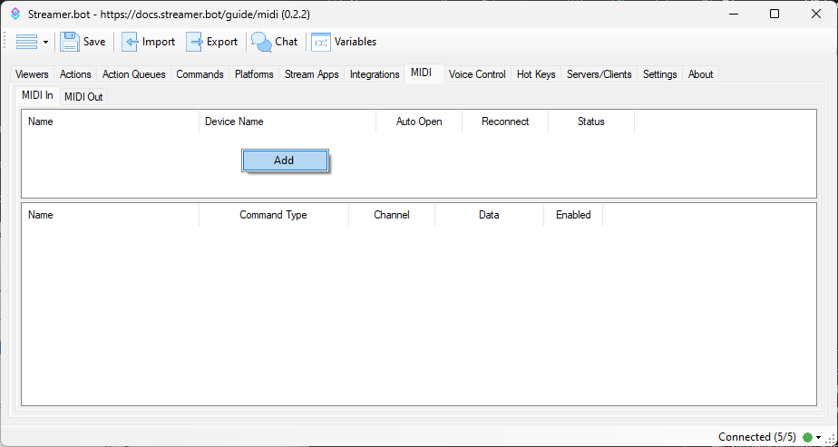
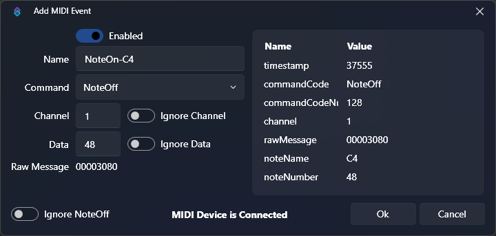

## Introduction
Streamer.bot ships with full MIDI input & output support, allowing you to execute your actions with the push of a button using your existing MIDI device, or even let your bot take control of your devices by using sub-actions to send outgoing MIDI commands.

## Devices
::callout{icon=i-mdi-navigation}
**In Streamer.bot**, navigate to the **MIDI** tab
::

::callout{icon=i-mdi-lightbulb color=amber}
`MIDI In` and `MIDI Out` devices are stored separately, so be sure to navigate to the appropriate tab for the type of interactions you would like to make. You can also add the same device in both tabs.
::

To add a new device, :shortcut{value="Right-Click"} anywhere in the device pane and select `Add`

This will open the add device dialog:

### Configuration
::field-group
  ::field{name=Name type=Text required}
  Enter a descriptive name for this device connection
  ::
  ::field{name=Device type=Select required}
  Select your device from a list of currently connected MIDI devices
  ::
  ::field{name="Auto Open on Startup" type=Toggle}
  Automatically connect to this device when Streamer.bot starts up?
  ::
  ::field{name="Reopen on Close" type=Toggle}
  Automatically reconnect to this device when the connection is closed?
  ::
  ::field{name="Retry Interval" type=Number}
  When `Reopen on Close` is enabled, retry the connection at the entered interval, in seconds
  ::
::

### Context Menu
:shortcut{value="Right-Click"} any existing device to reveal the context menu options:

::field-group
  ::field{name=Add}
  Add a new MIDI device, opening the [configuration](#configuration) dialog outlined above
  ::
  ::field{name=Edit}
  Edit the selected MIDI device, opening the [configuration](#configuration) dialog outlined above
  ::
  ::field{name=Delete}
  Delete the selected MIDI device connection
  ::
  ::field{name="Auto Open" type=Toggle}
  Quickly toggle the `Auto Open on Startup` configuration option for this device
  ::
  ::field{name=Reopen type=Toggle}
  Quickly toggle the `Reopen on Close` configuration option for this device
  ::
  ::field{name=Open}
  Manually open the connection to this device
  ::
::

## MIDI In

Once you have created a `MIDI In` device, you can select it to register your incoming event listeners in the bottom pane.

::callout{icon=i-mdi-alert color=amber}
Make sure the device is currently connected. You can manually :shortcut{value="Right-Click"} the device and select `Open`
::

With your device selected in the top pane, you can :shortcut{value="Right-Click"} on bottom pane and select `Add` to create a new event listener.

You should now see the `Add MIDI Event` dialog:

::callout{icon=i-mdi-check-circle color=green}
You can now **automatically generate** the event configuration by triggering an event from your MIDI device
- Press a key
- Press a pad
- Turn a dial, knob, or wheel
- Press any button which sends a MIDI message
::

### Configuration
::field-group
  ::field{name=Enabled type=Toggle}
  Enable or disable this event listener
  ::
  ::field{name=Name type=Text required}
  Enter a descriptive name for this event listener
  - Automatic detection is supported
  ::
  ::field{name=Command type=Text required}
  Select the MIDI event type you would like to listen to
  - Automatic detection is supported
  ::
  ::field{name=Channel type=Number required}
  Enter the MIDI channel to listen on
  - Automatic detection is supported
  ::
  ::field{name="Ignore Channel" type=Toggle}
  Listen on **any channel**
  ::
  ::field{name=Data type=Number required}
  Enter the MIDI data value to listen for
  - Automatic detection is supported
  ::
  ::field{name="Ignore Data" type=Toggle}
    Listen on **any data value**
    ::callout{icon=i-mdi-lightbulb color=amber}
    This can be useful if you would like to trigger an action on any key value
    ::
  ::
  ::field{name="Raw Message" type=ReadOnly}
  Displays the raw MIDI message value
  ::
  ::field{name="Ignore NoteOff" type=Toggle}
    Ignore `NoteOff` events
    ::callout{icon=i-mdi-lightbulb color=amber}
    Some keyboards will send both `NoteOn` and `NoteOff` events. This option allows you to automatically generate event configuration for `NoteOn` without it being overridden by the following `NoteOff` event
    ::
  ::
::

### Triggers
All configured incoming MIDI events can be used to trigger your actions via [triggers](/api/triggers/core/midi)

## MIDI Out
All outgoing MIDI messages can be configured directly in [sub-actions](/api/sub-actions/core/midi)

## Usage
:api-reference-cards{path=core/midi}