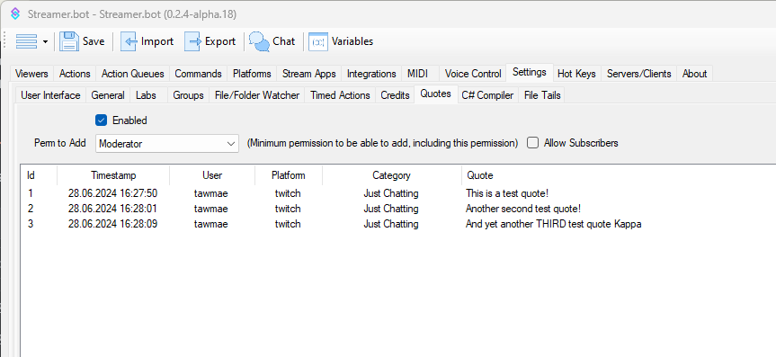
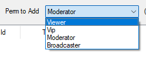
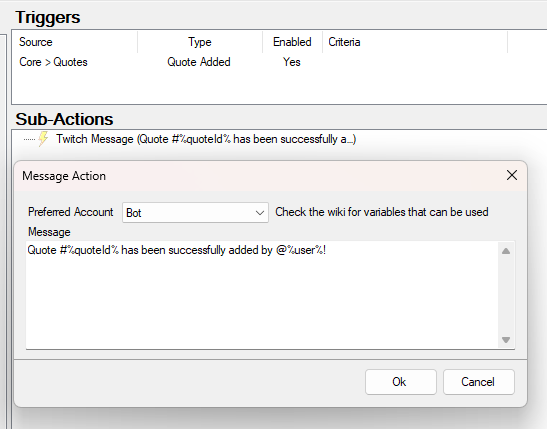
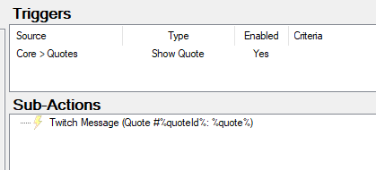
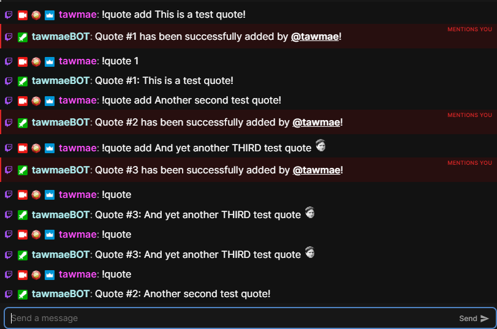

## Setup
In order to use the built in quote system, navigate to `Settings -> Quotes` and check `Enabled`. 

In here you'll see all quotes that have been added to your Streamer.bot already and you'll also be able to change the permissions to add quotes. 

::tip
Deleting quotes is reserved for the broadcaster and moderators only.
::

And you're all done already!

## Commands
The quote commands are also already built in. So you don't need to create any extra commands.

`!quote add [Quote]`

Adds the quote.

`!quote del [Quote ID]`

Deletes the specified quote.

`!quote [Quote ID]`

Shows the specified quote in chat.

`!quote`

Shows a random quote in chat.

::tip
You'll need a `Show Quote` trigger to display quotes in chat. See below.
::

### Triggers
You can add triggers for adding and showing quotes.

1. Quote Added
   
   The "Quote Added" trigger fires whenever you add a quote. It's totally optional, but you can use it to give a chat response that quote X has been successfully added.

   

3. Show Quote
   
   The "Show Quote" fires upon entering the `!quote` or `!quote [Quote ID]` command. To display quotes in chat, that one is required. This trigger already handles specific and random quotes automatically.

   

## Usage
:api-reference-cards{path=core/quotes}
