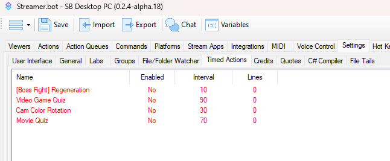
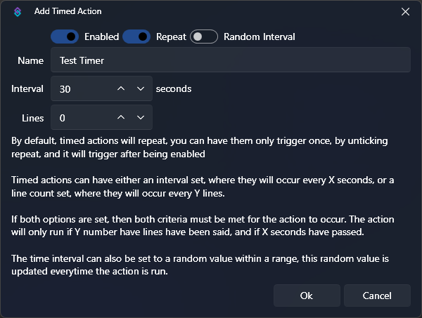

## Setup
Navigate to `Settings -> Timed Actions`, rightclick the white area and click `Add`. 

You can now specify the settings of your Timed Action:

`Enabled`: If checked, the Timer is enabled. It will not trigger any action or if it's disabled. The countdown and line count only start once it's been enabled.

`Repeat`: If checked, the Timer will run again after it has fired. If unchecked, the Timer will just run once and disable itself afterwards.

`Name`: The name of your Timer. It has no direct impact and it just for your own organisation.

`Interval`: The time in seconds that has to pass for the Timer to trigger.

`Random`: If checked, you can specify an interval for the interval. So the Timer fires randomly between x and y seconds.

`Lines`: If lines is greater than 0, then x many chat messages need to be posted before the Timed Action fires. If the Interval is set to 30 seconds and Lines to 5, then it will trigger after 30 seconds have passed **and** 5 different messages have been posted to chat. If one requirement is fulfilled, it will wait for the other requirement.

::warning
The Lines requirement does not work if you have multiple streaming platforms connected (like Twitch **and** YouTube). In that case, leave it at 0.
::

## Usage
:api-reference-cards{path=core/timers}
:api-reference-cards{path=core/timed-actions}

## C# Usage
:csharp-method{name=DisableTimer}
:csharp-method{name=EnableTimer}
:csharp-method{name=GetTimerState}
:csharp-method{name=SetTimerInterval}
