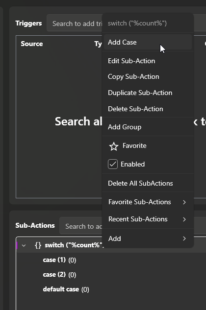

You can add any number of cases to a switch by right clicking on the `switch` Sub-Action and selecting "Add Case"

You can add one or more values to a case.  If any of the case's values match the `switch` input, that case will be run.

::note
Only the first matching case will be run

If no cases match, the `default` case will be run
::