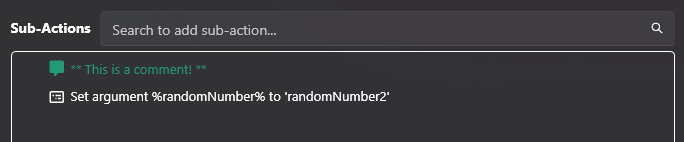

# Comment
Add a comment to your sub-actions list
:image-preview

## Parameters
### `Comment`
Enter the text for your comment

### `Color`
Customize the color of your comment text
- *Optional*

## Usage
This is a basic utility sub-action allowing you to add quick comments for things such as:

- Section labels/titles
- Detailed instructions
- Argument descriptions
- Anything you find useful!

Example comment in sub-actions list:
