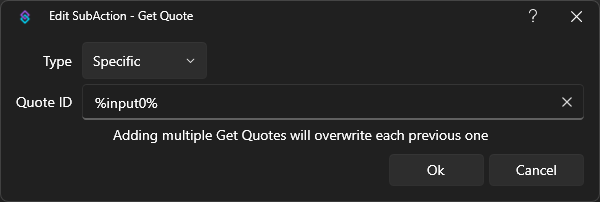

::tip
Deleting a quote does not change the Quote ID of following quotes 
You can Re-Index quotes manually under `Services > Quotes` by right-clicking and choosing `Re-index` from the context menu.  **This operation can not be undone**
::

:read-more{to=examples/quotes-commands}