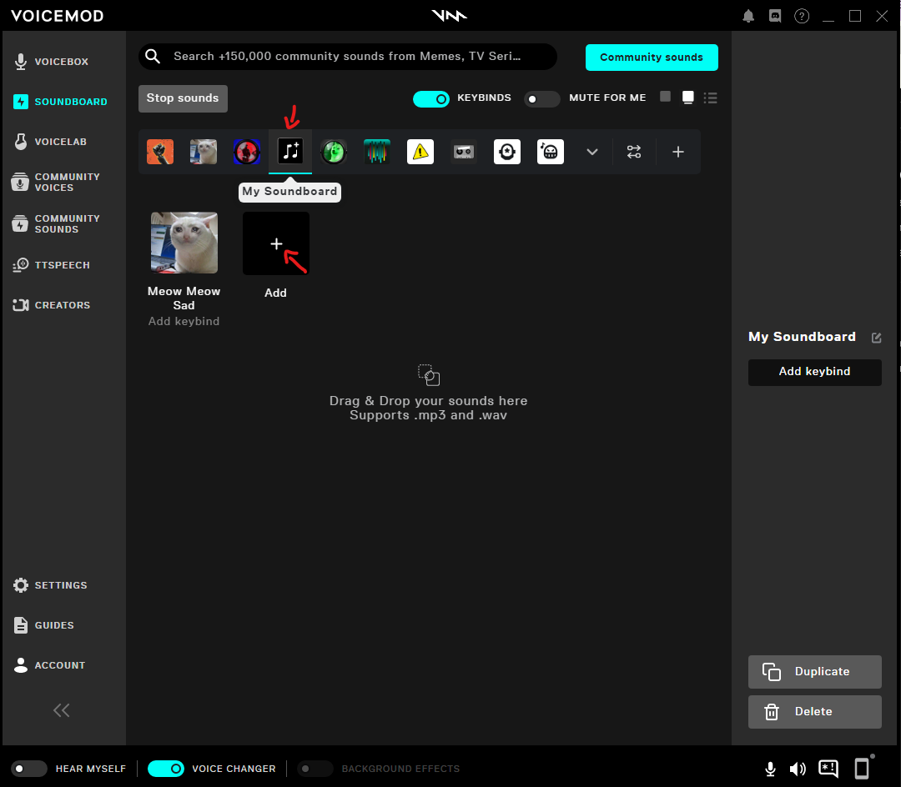

::warning
VoiceMod starts with an empty default soundboard that is called "My Soundboard". Before you add the subaction, make sure the soundboard has at least one sound assigned to it. Streamer.bot might crash otherwise.

::
