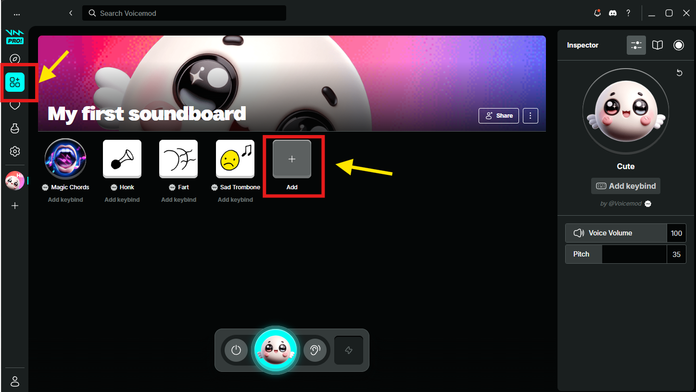

::warning
VoiceMod starts with a default soundboard called "My Soundboard" which contains no sounds.
:br
Before you add this sub-action, **make sure the soundboard has at least one sound assigned to it**.
:br
:br

::
