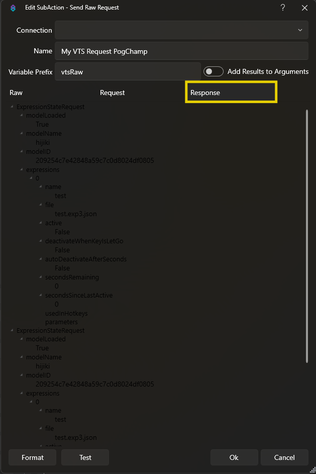
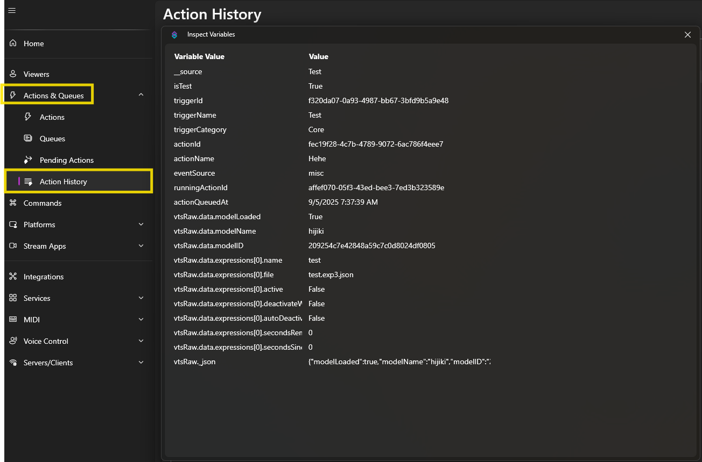

## How to send a VTS Raw request

::note
All request types can be found at the official VTubeStudio API documentation on Github: [VTube Studio API Development Page](https://github.com/DenchiSoft/VTubeStudio?tab=readme-ov-file#contents)
::

1. First we are looking for the request we want to make. You can find your exact request type in the VTS API documentation. In our example, we'll do a [**ExpressionStateRequest**](https://github.com/DenchiSoft/VTubeStudio?tab=readme-ov-file#requesting-current-expression-state-list).

2. We create the subaction `Integrations -> VStudio -> Send Raw Request`. The `Request` field of the subaction gets the `messageType` key shown in the documentation. That's the area marked in orange. 

     
    

3. The actual big input area is the `data` key, marked in yellow. But here we only copy everything within (and including) the curly brackets.

::tip
If the request shown in the documentation doesn't have a `data` key (like the `CurrentModelRequest`), then you just do empty curly brackets as the input: `{}`
::

4. For the `ExpressionStateRequest`, we are looking for a specific expression of ours which is just called `test`, so we replace `myExpression_optional_1.exp3.json` with `test.exp3.json`. So in case you have to specify certain values, make sure to replace the placeholders.

5. Now we are ready to test the request by either hitting "Test" on the subaction or just running the entire action *(running the entire action would populate `%variables%` if we used any in the request)*.

   
   

6. We can check the populated variables in the response of the subaction or in the Action History after running the action.

7. Done!
