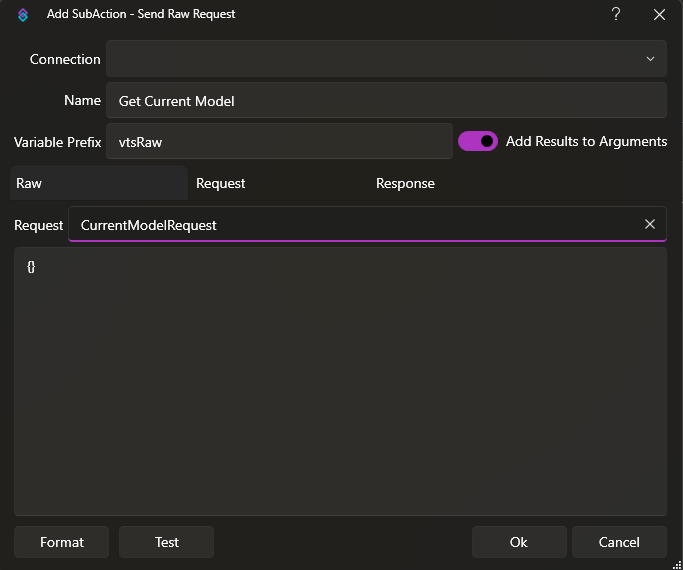
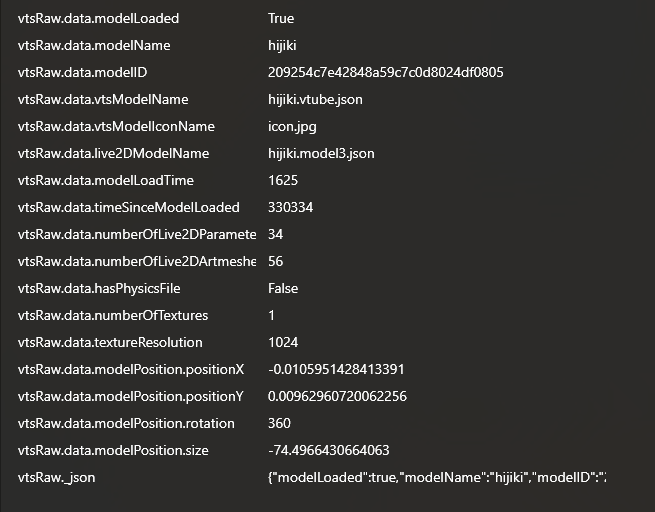

## Example
Here's an example of a `CurrentModelRequest` to get information about the current model:

Running the action will then populate these variables:

For all requests, please refer to the VTS documentation: https://github.com/DenchiSoft/VTubeStudio?tab=readme-ov-file#api-details
