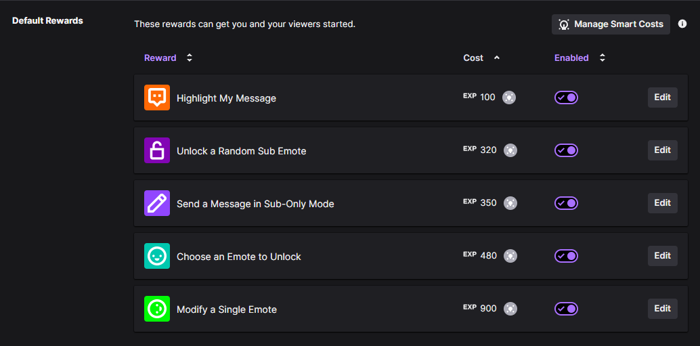
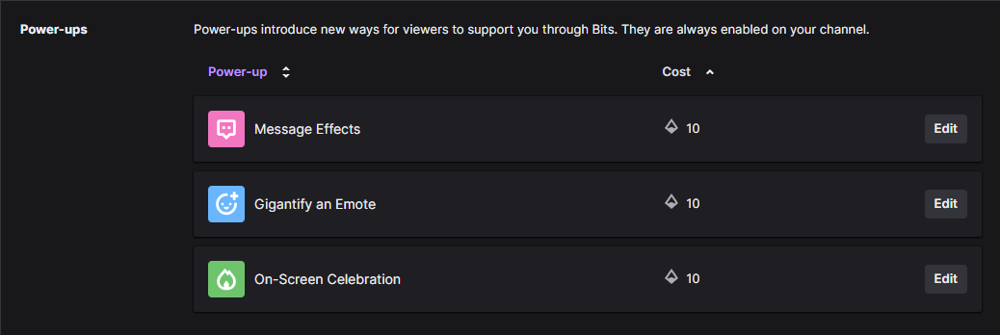

## Details
The Automatic Reward Redemptions work for both "default rewards" as well as the newly introduced "Power-ups".

### Default Rewards
The default rewards are those made by Twitch like "Highlight My Message". You can either choose to enable or disable them, but you cannot delete and only restrictively edit them.



### Power Ups
Power-ups have been added to Twitch on June 12, 2024 and are available in your Channel Reward window. It allows viewers to do specific interactions with bits.




In order to to filter for Power-ups in Streamer.bot, you can create an `if/else` subaction and check for the variable `rewardType`:

```
message_effect
gigantify_an_emote
celebration
```
