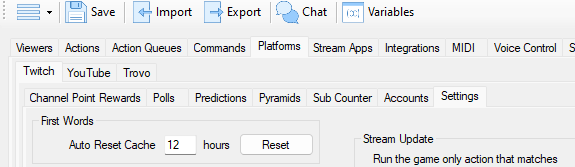

## Details
This triggers when someone sends their first message of the stream.

The exact reset time is set in `Platforms -> Twitch -> Settings` and is `12h` by default. That means that StreamerBot must have been closed for 12 hours in order to reset the First Words trigger.

::tip
You can create a new action, then create a  `Settings -> Reset First Words` subaction and assign a `Twitch -> Channel -> Stream Online` trigger. This will automatically reset the First Words trigger once you go live without any time requirement.
::

## Parameters
::field-group
  ::field{name="User Name" type=Text}
    If you want to filter on a user name, you can enter a user name in this field
  ::
  ::field{name="Is UserId" type=Checkbox}
    Check this field if the text in the `User Name` field is a user id
  ::
::
