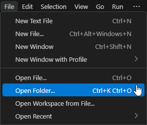
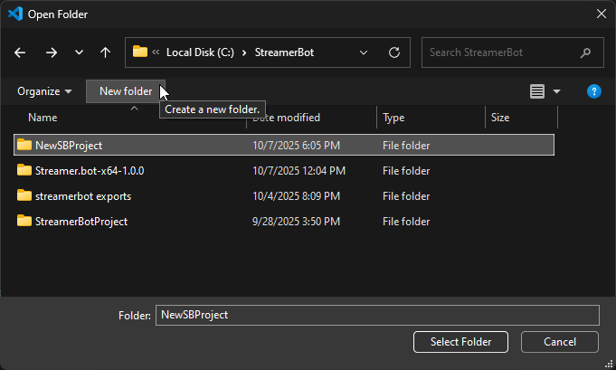
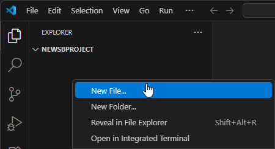
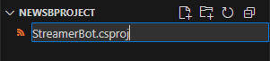
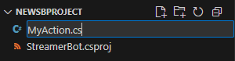
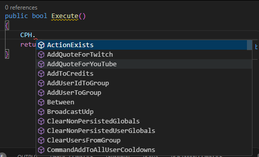
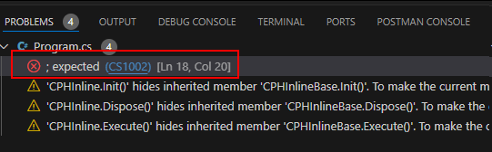
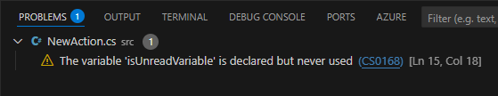
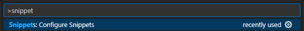
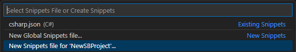

This tutorial provides a general step-by-step guide on setting up Visual Studio Code (VS Code) for writing C# code for Streamer.bot.

By following these instructions, you'll be able to write code with linting, which will help you catch errors early and ensure your code compiles before copying into Streamer.bot

## Prerequisites

::card-group
  ::card{title="Visual Studio Code" icon="mdi:microsoft-visual-studio-code" to="https://code.visualstudio.com/download"}
    Follow the installation instructions for your operating system
  ::

  ::card{title="VSCode C# Extension" icon="vscode-icons:file-type-csharp" to="https://marketplace.visualstudio.com/items?itemName=ms-dotnettools.csharp"}
    This is the necessary extension for C# development and includes the .NET Install Tool
  ::
::

## Setup Guide

::steps{level=3}
### Create a new Streamer.bot Project Folder

::navigate
In **Visual Studio Code**, select `File > Open Folder` from the menu bar
::



Select an existing empty folder, or create a new project folder, and then select it to open:

{width=500 caption="Open Folder Dialogue"}

### Create a `.csproj` File

::navigate
Open the `Explorer` view by selecting `View > Explorer` from the menu bar, or use the shortcut :kbd{value=meta} :kbd{value=shift} :kbd{value=E}
::

1. Create a new file by right-clicking in the `Explorer` pane and selecting `New File` from the context menu:

  

2. Name the file, ending with `.csproj`

  

  :br

3. Paste the contents from the code block below into your new `.csproj` file:

  ::code-collapse
  ```xml [StreamerBot.csproj]
  <Project Sdk="Microsoft.NET.Sdk">
    <PropertyGroup>
      <OutputType>Exe</OutputType>
      <TargetFramework>net481</TargetFramework>
      <LangVersion>13.0</LangVersion>
      <Nullable>enable</Nullable>
      <UseWPF>true</UseWPF>
      <DefineConstants>EXTERNAL_EDITOR</DefineConstants>
      <NoWarn>CS0114</NoWarn>

      <!-- Set the following directory with your Streamer.bot install location -->
      <StreamerBotPath>C:/path/to/streamer.bot-directory</StreamerBotPath>
    </PropertyGroup>
    <ItemGroup>
      <!-- Automatically include in every CS file -->
      <Using Include="Streamer.bot.Plugin.Interface" />
      <Using Include="Streamer.bot.Plugin.Interface.Model" />
      <Using Include="Streamer.bot.Plugin.Interface.Enums" />
      <Using Include="Streamer.bot.Common.Events" />

      <!-- Use forward slashes for cross-platform compatibility -->
      <Reference Include="$(StreamerBotPath)/Streamer.bot.Plugin.Interface.dll" />
      <Reference Include="$(StreamerBotPath)/Streamer.bot.Common.dll" />
      <Reference Include="$(StreamerBotPath)/Twitch.Common.dll" />

      <Reference Include="$(StreamerBotPath)/NAudio*.dll" />
      <Reference Include="$(StreamerBotPath)/Wpf*.dll" />
      <Reference Include="$(StreamerBotPath)/Newtonsoft.Json.dll" />

      <!-- Uncomment the following line to reference all dlls in the streamerbot directory -->
      <!-- <Reference Include="$(StreamerBotPath)/**/*.dll" /> -->
    </ItemGroup>
  </Project>
  ```
  ::

:br

4. Replace the value of the `<StreamerBotPath>`{lang=xml} xml tag to point to your Streamer.bot directory and save the file.

::warning
Do not use quotes around your Streamer.bot directory path, even if it contains spaces.
::

::note
**Notes about `StreamerBot.csproj`**
- This file includes the Streamer.bot using statements in every `.cs` file automatically
- This file configures the project as a `.NET Framework 4.8.1` project
- To point to your own Streamer.bot dlls, replace the contents of `<StreamerBotPath>` with the path to your own Streamer.bot directory (containing `Streamer.bot.exe` and `.dll` files)
::

### Create a .cs File

::navigate
Open the `Explorer` view by selecting `View > Explorer` from the menu bar, or use the shortcut :kbd{value=meta} :kbd{value=shift} :kbd{value=E}
::

Create a new file ending with the `.cs` extension. This is the file we will use for our C# Code action:



Paste the `C# Code Example` below into your `.cs` file, replacing `UniqueClassName` with your filename

::code-collapse
```cs [UniqueClassName.cs]
using System;

/*----- Class name should match <filename>.cs -----*/
#if EXTERNAL_EDITOR
public class UniqueClassName : CPHInlineBase
#else
public class CPHInline
#endif
/*--------------------------------------------*/
{
    public bool Execute()
    {
        // Add your code here
        return true;
    }
}
```
::

::read-more{to=#file-template-snippet}
You can also create a snippet to make scaffolding new files easier.
See the [File Template Snippet](#file-template-snippet) section below for more information.
::

#### `.cs` Notes

- This is similar to the default code found in the `Execute C# Code` subaction
- The first four lines are required in VS Code, but are used by default and not needed in Streamer.bot
- The `#if EXTERNAL_EDITOR` preprocessor directive is set to true by the `.csproj` we just created, but is not active in Streamer.bot's editor.
  - In VS Code, each class name in a project must be unique, so changing `UniqueClassName` to the FileName avoids conflicts, while explicitly inheriting from `CPHInlineBase`, the class which provides the `CPH` instance all of our Streamer.bot methods belong to.
  - In Streamer.bot, the class must be called `CPHInline`, which automatically inherits from `CPHInlineBase`.

::

::success
**You can now write code with assistance from IntelliSense!**

- You can now type `CPH.` and it will automatically give you the available `CPH` methods
  - This uses the `Streamer.bot.Plugin.Interface.dll` in your Streamer.bot folder
  - The advantage of this is that you will have an up-to-date list of methods, classes, and enums available
::



## Debugging
While writing your code, you can check for compilation errors in the `Problems` view.

::navigate
Open the `Problems` panel by navigating to `View > Problems` or use the shortcut :kbd{value=meta} :kbd{value=shift} :kbd{value=M}
::

Compilation errors will be shown in red, and will prevent your code from compiling:




Warnings will be shown in yellow, but will not prevent your code from compiling:




## Copying Code to Streamer.bot

When you code is ready to run in Streamer.bot, you can copy it into an [Execute C# Code](/api/sub-actions/core/csharp/execute-csharp-code) sub-action.

::steps{level=3}
  ### Select your Action

  ::navigate
  In **Streamer.bot**, navigate to the `Actions` panel
  ::

  - Create or select an existing action
  - Add or select an `Execute C# Code` sub-action

  ### Copy your C# Code
  - You can copy the entirety of your `.cs` file into Streamer.bot's C# code editor.

  ::tip
  The preprocessor directives will ensure the VSCode specific sections are not active inside Streamer.bot.
  ::

  - Make sure the code compiles successfully by clicking `Compile`
  - Click `Save and Compile`

  ::note
  If you see any errors ending with `(are you missing an assembly reference?)`, click `Find Refs`
  ::

  ::success
  Your code has now been added inside an `Execute C# Code` Sub-Action and is ready to run in your Action!
  ::
::

## Additional Steps

These steps are optional, but can help speed up your workflow.

### File Template Snippet
To make creating new `.cs` files easier, you can create a workplace snippet that will fill in the Streamer.bot C# sub-action template code for you.

::navigate
Open the `Command Palette` with :kbd{value=meta} :kbd{value=shift} :kbd{value=P} and select `Snippets: Configure Snippets`
::



Select the option to create a new snippets file for the current workspace, and enter a filename like `sbSnippets`:



Replace the contents of your new `.code-snippets` file with the code below:
  ::code-collapse
  ```json
  {
      "Execute C# Sub-Action Template" : {
      "scope": "csharp",
          "isFileTemplate": true,
          "prefix": "streamer.bot-file-template",
          "description": "New Execute C# Sub-Action for Streamer.bot",
          "body": [
              "using System;",
              "",
              "/*----- Class name should match FileName -----*/",
              "#if EXTERNAL_EDITOR",
              "public class ${TM_FILENAME_BASE} : CPHInlineBase",
              "#else",
              "public class CPHInline",
              "#endif",
              "/*--------------------------------------------*/",
              "{",
              "    public bool Execute()",
              "    {",
              "        ${0:// Add your code here}",
              "        return true;",
              "    }",
              "}"
          ]
      }
  }
  ```
  ::

::success
You can use workplace snippets to quickly scaffold new Streamer.bot C# files!
- After creating new .cs files, you can now fill them with the snippet by either typing `sbfile`, and selecting the `streamer.bot-file-template` from the dropdown, or by running `Snippets: Fill File with Snippet` from the Command Palette
::
