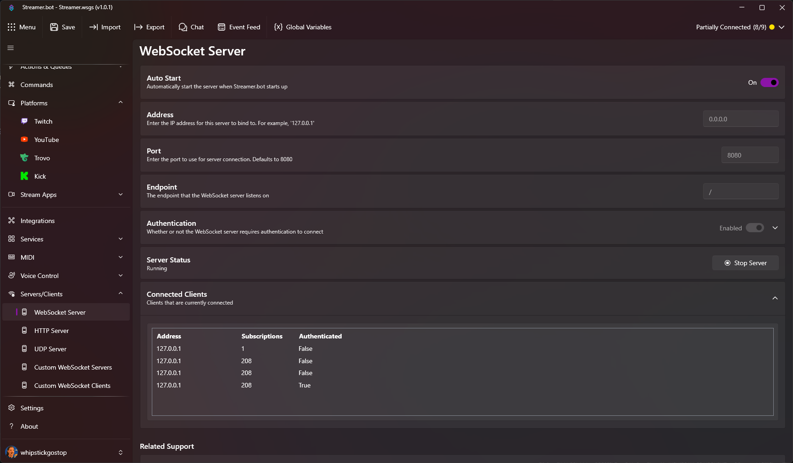

::navigate
  Navigate to **Servers/Clients > WebSocket Server** in Streamer.bot
::

{caption="WebSocket Server Settings"}

### Options
::field-group
  ::field{name="Auto Start" type="Toggle" default=true}
    Automatically start the WebSocket Server when Streamer.bot starts
  ::

  ::field{name="Address" type="Text" default="127.0.0.1"}
    The IP address the WebSocket Server will bind to

    ::tip
      You can set this to `0.0.0.0` to bind to all available network interfaces and make the server accessible from other devices on your network.
    ::
  ::

  ::field{name="Port" type="Number" default=8080}
    The port the WebSocket Server will listen on
  ::

  ::field{name="Endpoint" type="Text" default="/"}
    The endpoint path for the WebSocket Server
  ::

  ::field{name="Authentication" type="Toggle" default=false}
    Enable authentication for WebSocket clients

    ::tip
      By default, authentication is only enforced on priveleged requests, such as `SendMessage`
      To enforce authentication for all requests, enable the `Enforce` option outlined below
    ::
  ::

  ::field{name="Enforce" type="Toggle" default=false}
    Enforce authentication for all requests

    ::tip
      If enabled, all clients must authenticate using the `Authenticate` request
    ::
  ::

  ::field{name="Password" type="Text"}
    The password required for clients to connect if authentication is enabled
  ::
::

### Example

To connect to the WebSocket Server using the [Streamer.bot Client](https://streamerbot.github.io/client)

```ts
const client = new StreamerbotClient();
```

You can also specify custom connection options, if you have changed the default settings outlined above.

```ts
const client = new StreamerbotClient({
  host: '127.0.0.1',
  port: 8080,
  endpoint: '/',
  password: 'my-secret-password' // Only needed if authentication is enabled
});
```

::read-more{to="https://streamerbot.github.io/client"}
Refer to the **Streamer.bot Client** documentation for more details
::