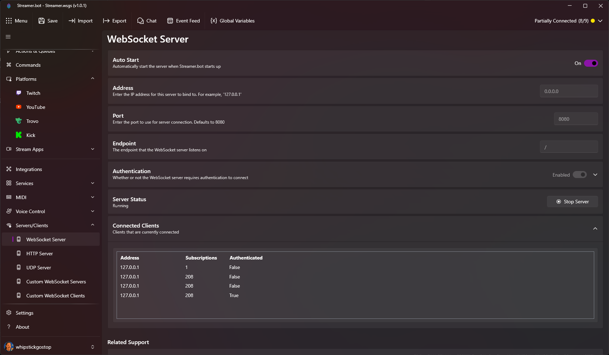

::navigate
  Navigate to **Servers/Clients > WebSocket Server** in Streamer.bot
::

{caption="WebSocket Server Settings"}

## Parameters

::api-page-parameters
---
parameters:
  - name: Auto Start
    type: Toggle
    default: 'true'
    description: Automatically start the WebSocket Server when Streamer.bot starts
  - name: Address
    type: Text
    default: '127.0.0.1'
    description: |
      The IP address the WebSocket Server will bind to

      ::tip
      You can set the host address to `0.0.0.0` to bind to all available network interfaces and make the server accessible from other devices on your network.
      ::
  - name: Port
    type: Number
    default: 8080
    description: The port the WebSocket Server will listen on
  - name: Endpoint
    type: Text
    default: '/'
    description: The endpoint path for the WebSocket Server
  - name: Authentication
    type: Toggle
    default: 'false'
    description: |
      Enable authentication for WebSocket clients

      ::tip
      By default, authentication is only enforced on privileged requests, such as `SendMessage`.
       
      To enforce authentication for all requests, enable the `Enforce` option outlined below.
      ::
  - name: Enforce
    type: Toggle
    default: 'false'
    description: |
      Enforce authentication for all requests

      ::warning
      If enabled, all clients must first authenticate using the `Authenticate` request
      ::
  - name: Password
    type: Text
    description: The password required for clients to connect if authentication is enabled
---
::
