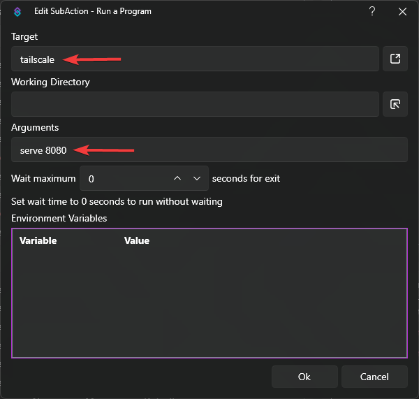
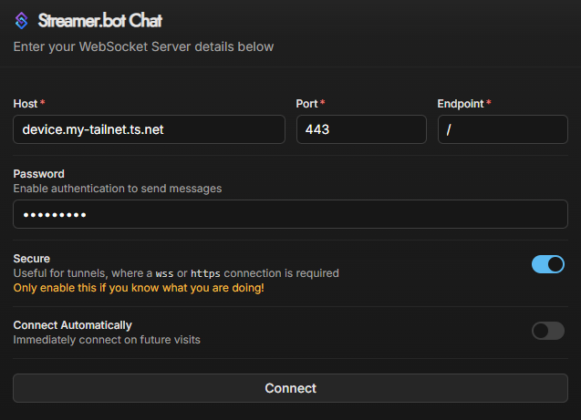

When interacting with the Streamer.bot WebSocket Server, you may want to access your instance from other devices, such as your phone or another computer.

Depending on your use case, there are a few different ways to achieve this.

## Local Area Network (LAN)
You can access your Streamer.bot instance over your local network by simply using the local IP address of the machine running Streamer.bot.

### Configuration

By default, Streamer.bot's WebSocket server only listens to connections from `localhost` (i.e. the same machine).

To allow connections from other devices on your local network, you need to change the `Address` setting in the WebSocket settings.

You can listen to **only** LAN devices by setting `Address` to your LAN IP address, or you can simply listen on all adapters by setting `Address` to `0.0.0.0`

### Example

For example, if you have an HTML/Javascript overlay utilizing the Streamer.bot Client, you would change the `host` property to the local IP address of the machine running Streamer.bot.

```js
const client = new StreamerbotClient({
  host: '192.168.1.10' // Replace with your local IP address
});
```

### Mixed Content Restrictions

If you try to interact with the Streamer.bot WebSocket server via a web page hosted from `https://`, most web browsers will block `ws://` connections to any non-localhost address due to mixed content restrictions.

There are a few ways to get around this:

- :badge{label="Secure" color="success" icon="mdi:lock" size=sm} You can use the other remote access methods below to securely connect via `wss://`{lang=bash}
- :badge{label="Insecure" color="warning" icon="mdi:alert" size=sm} You can use the `--allow-running-insecure-content`{lang=bash} flag in Chromium based browsers
  - :badge{label="Note" color="info" icon="mdi:information-circle-outline" size=sm} This flag will also work for **OBS Studio** and allow connections from any browser sources or docks, such as [Streamer.bot Chat](/guide/extra-features/chat)
- :badge{label="Insecure" color="warning" icon="mdi:alert" size=sm} You can host your web page via `http://`{lang=bash} instead of `https://`{lang=bash}

## Virtual Private Network (VPN)
A VPN allows you to securely connect to your home network from anywhere in the world.

### Tailscale

::read-more{to="https://tailscale.com/kb/1017/install"}
[Tailscale](https://tailscale.com/kb/1017/install) is a VPN based on WireGuard that makes it easy to securely communicate between your devices.
::

::steps{level=4}

#### Install Tailscale
1. Follow the [installation instructions](https://tailscale.com/kb/1017/install) to install Tailscale on the machine running Streamer.bot and any other devices you want to connect from.
2. Log in to Tailscale using your preferred authentication method.
3. Ensure that the devices are connected and can see each other in the Tailscale admin console.

#### Configure Tailscale Serve

:::warning
**Tailscale Serve** requires HTTPS certificates to be enabled on your tailnet.
<br>
You can ensure this option is enabled in your [Tailnet DNS Settings](https://login.tailscale.com/admin/dns)
:::

To serve your Streamer.bot WebSocket Server to all devices on your tailnet, we can use **Tailscale Serve**.

This will createa secure `wss://` endpoint that you can use to connect to your Streamer.bot instance from any devices on your tailnet.

:::read-more{to=https://tailscale.com/kb/1312/serve}
Refer to the [Tailscale Serve documentation](https://tailscale.com/kb/1312/serve) for more information.
:::

**Execute Tailscale Serve via Command Line**

:::note
Replace `8080` with the port your Streamer.bot WebSocket server is running on. By default, this is `8080`
:::

```bash [Terminal]
tailscale serve 8080
```

:br

**Execute Tailscale Serve via Streamer.bot**

Alternatively, we can use the [Run a Program](/api/sub-actions/core/system/run-a-program) sub-action to execute the command directly from Streamer.bot, allowing use of [triggers](/guide/triggers) to start Tailscale Serve when certain events happen.

For example, if you add the [Streamer.bot Started](/api/triggers/core/system/streamerbot-started) trigger to your action, Tailscale Serve will automatically start whenever Streamer.bot starts up!

{width=400}

:br

:::success
You should see a command line window open, with the URL to access your Streamer.bot WebSocket server via Tailscale Serve.
:::

#### Connect to Streamer.bot
You can now connect to your Streamer.bot instance from any device on your tailnet using the URL provided by Tailscale Serve.

:::note
Because Tailscale Serve uses HTTPS, the port you use to connect will always be `443` and you will need to use `wss://` scheme.
:::


**Examples**

::tabs

:::tabs-item{label="Streamer.bot Client" icon="vscode-icons:file-type-js"}

```js
const client = new StreamerbotClient({
  host: 'device.my-tailnet.ts.net',
  port: 443,
  scheme: 'wss'
});
```

:::

:::tabs-item{label="Streamer.bot Chat" icon="mdi:chat"}

You can use Streamer.bot Chat as a browser dock, or from mobile devices at [`chat.streamer.bot`{color=primary}](https://chat.streamer.bot){target=_blank}

To connect securely via Tailscale Serve:

- Set the `Host` field to your Tailscale Serve hostname (e.g. `device.my-tailnet.ts.net`)
- Set the `Port` field to `443`
- Enable the `Secure` toggle

{width=500}

:::

::

:br

## Secure Tunnel

Tunneling services allow you to expose your local Streamer.bot instance to the internet securely.

### Cloudflare Tunnel

::read-more{to="https://developers.cloudflare.com/cloudflare-one/connections/connect-networks/"}
[Cloudflare Tunnel](https://developers.cloudflare.com/cloudflare-one/connections/connect-networks/) allows you to securely expose your local servers to the internet.
::

### ngrok

::read-more{to="https://ngrok.com/"}
[ngrok](https://ngrok.com/) is a popular tool to expose local servers to the internet.
::

### Tailscale Funnel

::read-more{to="https://tailscale.com/kb/1223/funnel"}
[Tailscale Funnel](https://tailscale.com/kb/1223/funnel) allows you to expose local servers to the internet using Tailscale.
::
