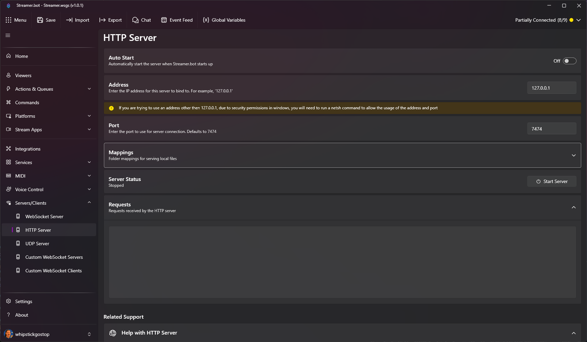

::navigate
In Streamer.bot, navigate to **Servers/Clients > HTTP Server**
::

## Parameters

::api-page-parameters
---
parameters:
  - name: Auto Start
    type: Toggle
    default: 'false'
    description: Enable this to automatically start the HTTP server when Streamer.bot starts
  - name: Host
    type: Text
    default: '127.0.0.1'
    description: The host address for the HTTP server (e.g., `localhost` or `127.0.0.1`)
  - name: Port
    type: Number
    default: 7474
    description: The port number for the HTTP server
  - name: Mappings
    type: List
    description: |
      A list of URL path mappings to local directories or files to serve via HTTP.

      - `Path`: The URL path to map to (e.g., `/files`)
      - `Folder`: The local directory or file to serve (e.g., `C:\path\to\directory`)
---
::