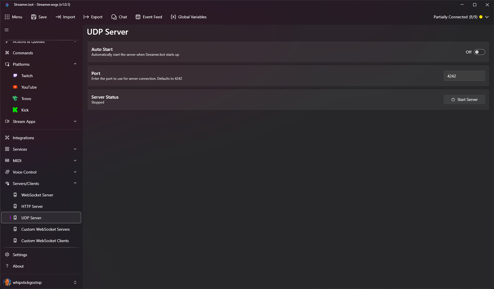

Enable software on your local machine to interact with Streamer.bot using UDP broadcasts.

::read-more{to="https://github.com/nate1280/voiceattack-Streamer.bot" target=_blank rel=noopener}
Check out the Streamer.bot **Voice Attack plugin**, which utilizes the UDP Server
::

{caption-alt}

::navigate
In Streamer.bot, navigate to **Servers/Clients > UDP Server**
::

## Parameters

::api-page-parameters
---
parameters:
  - name: Auto Start
    type: Toggle
    default: 'false'
    description: Enable this to automatically start the UDP server when Streamer.bot starts
  - name: Port
    type: Number
    default: 4242
    description: The port the UDP server will listen on
---
::
