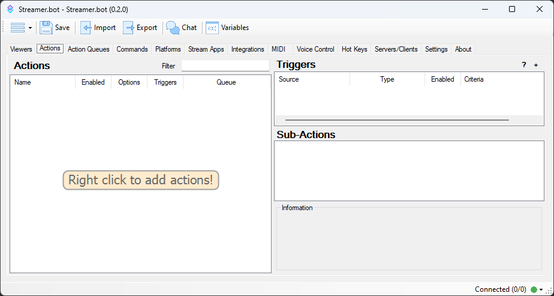

What's this, an actual version bump, or at least a minor one!



## New Features
::changelog-list{type=new}
* Add new sub-action to set action queue's blocking state
* Add new sub-action to set a Twitch Reward's background color
* Add C# method to update a Twitch Reward's background color
* Add new sub-action Twitch Reply To Message
* Add new C# Method, TwitchReplyToMessage
* Actions will now show red when disabled
* [Triggers](#triggers)!
* New C# methods for Triggers
* [VTube Studio](#vtube-studio) Integration!
* A new [Global Variables Viewer](#global-variables-viewer)
* New [Inline Chat Window](#inline-chat-window) feature, see Twitch and YouTube chat within **Streamer.bot**
* Add list of users gifted a sub in the Twitch Gift Bomb event
* Add support for Twitch's new Hype Chat
* Add new [Websocket request](#new-websocket-requests), `ExecuteCodeTrigger`
* Add new [Websocket request](#new-webcosket-requests), `GetCodeTriggers`
* [CrowdControl 2.0](#crowdcontrol-20) Integration!
* [Elgato Wave Link](#elgate-wave-link) Integration!
* Add new [YouTube Bot](#youtube-bot-account) account
* Add new [C# Method](#new-c-methods), ObsSendBatchRaw
* Add new [C# Methods](#new-c-methods) for using User global variables
* Add new [C# Methods](#new-c-methods) for retrieving Twitch User information
* Split out Third Party Emote Handling
* Add support for SevenTV's real-time emote updates
* Add support for BetterTTV's real-time emote updates
* Add new Important Information popup, when a new release happens, I'll be able to relay information that must be seen, only once at startup
* Add a startup splash screen
* Add new [`~globalVariable~`](#inline-global-accessor) accessor to variables
* Add new sub-action, Tray Notification, this will allow you to create a custom tray notification from the Streamer.bot tray icon
* Add new sub-action, Set Voice Control Input, allowing you to change which Input device Voice Control is using
* Add 2 new C# methods for adding a quote
* Add 2 new sub-actions, Reset Credits and Reset First Words
::

## Updates
::changelog-list{type=update}
* Update how events are handled internally
* Tweaks to LiteDB handling
* Tweaks to Credits for Twitch, should add presence for any event now
* Add some more logging during shutdown
* Change how shutdown works from an update
* Add url check to Websocket Client creation
* Add Twitch Bot information (if available) to Websocket `GetBroadcaster` method
* Allow !commands on internal Twitch message parsing, this means !commands typed in the inline chat will work
* For those running a prerelease build (beta, or alpha), your logging will be automatically pushed to verbose
* Update how [Export](#import-export) works
* Update [Import](#import-export) to handle new features, and give it a new UI with new interactions
* Commands that are disabled will now show as red in the main window
* Add validation checks to Midi Note On sub-action
* Update Speak sub-action to allow variable support for alias
* Update how commands are stored internally
* Enable the vertical scrollbar for the command text box in the command dialog
* Better handling of shutting down the OBS Service
* Tweaks to startup procedures
* Update handling of inline variable parsing
* Add Twitch and YouTube bot information to the HTTP GetBroadcaster call
* Have the Streamer.bot tray icon always visible
* Tweaks to sub-action categories
* Update Twitch EventSub with changes to Guest Star
* Update Discord Basic Webhook sub-action to support URLs for images
::

## Fixes
::changelog-list{type=fix}
* Misc fixes and tweaks throughout
* Fix 7TV emotes not being parsed
* Fixes to shutdown routines
* Fix some threads not being stopped properly
* Fix maximum for Twitch Sub-counter Rollover, it's now 32,767 (from 100)
* Fix data validation in Twitch Prediction dialog
* Fix data validation in Twitch Poll dialog
* Fix Twitch EventSub related issues, potential duplicate events
* Fix Handling of DoActions across various methods to parse properly for C#
* Fix Global Variable, and GLobal User variables
* Fix FFZ emote url
* Fix potential crash in LumiaStream's Set Color sub-action
* When editing an Action Queue, Blocking was not being updated in the UI
* Fixes to bottom right status indicator and potential crashes
* Fix Twitch Broadcaster account sometimes being unflagged as broadcaster
* Fix Twitch Timeout and Ban User methods not working correctly
* Clearing confirmation dialog settings did not clear quote deletion confirmation
* Fix potential crash in Set Queue Pause State sub-actions
* Fix potential crash during shutdown of some services
* Fix potential crash in Set Action Queue State
* Fix PlaySoundFromFolder sub-action, was possible for no audio device to be selected
* Fix crash when deleting multiple actions
* Fix potential crash in Twitch EventSub library when deserializing events
* Fix potential crash in Http Service
* Fix potential crash when an action is completed
* Fix some unhandled exceptions in Streamer.bot Website Integration
* Set a minimum size for the sub-action panel on the actions tab
* Fix potential crashes related to Twitch Predictions
* Fix potential parsing error when assigning a weight value to a sub-action
* Some fixes to general OAuth authentication
* Handle a potential crash in OBS Set GDI Text sub-action dialog
* Handle a potential crash in SLOBS Set Random Filter State sub-action dialog
* Fix potential crash when getting version information of an OBS connection
* Handle potential null ref in the OBS service when a scene is changed
* Handle a potential null ref during the creation of an Execute C# Code
* Handle potential null ref when sending an ActionCompleted event to the Websocket
* Handle potential crash when a Twitch Reward Redemption is updated
* Fix changing log level not correctly setting log level for some libraries
* Fix wrong action being picked in a random action group, where there are multiple and all are disabled but 1
* Fix isSubscribed variable in arguments for Twitch users
* Fix auto-selection of newly added action
* Fix potential crash when receiving a Twitch Ad Event
* Fix potential crash in ReadRandomLinesFromFile sub-action dialog
* Handle potential crashes in MidiOut Generic sub-action dialog
* Handle potential crash in SLOBS when getting source filter list
* Fix Subscriber group in command grounds for Twitch users
* YouTube connection UI could enter a bad state from auto connect if tokens are invalid
* Fix issue with Twitch EventSub and multiple instances of Streamer.bot using the same Broadcaster account
* Handle possible crash in custom C# code when Dispose() is overridden and user code throws
* Handle potential crash in Read From File sub-actions when parsing invalid paths
* Handle potential crash in Write To File sub-action when parsing invalid paths
* Finally fix the removal of the Broadcaster flag for the Twitch broadcaster account
* Fix deletion of None group in Actions tab
* Fix deletion of None group in Commands tab
* Fix selection of duplicated action
* Fix multi-trigger commands not picking the correct command
::

## Details

### Triggers
Gone are the days of having to move through multiple tabs to assign an action to an event.

Now, you assign a Trigger directly to one or more actions that act on events.

There are currently **166** different Triggers available in **Streamer.bot**, and there will probably be more!

When upgrading from **0.1.22**, all your events that you have actions associated with, will be upgraded automatically to Triggers.

As you are using triggers, much like sub-actions, you will be able to favorite the ones you use the most by right clicking on the trigger within the menu.

Want an overview of triggers used, and which actions have them.  Within the main window, above the trigger list, there is a `?`, clicking this will open the trigger viewer, where you can see a full overview of triggers in use.  **Note** This window does not update in realtime, and requires a manual refresh if changes are made while it's open.

Also at the top of the triggers list, is a `+`, this will allow you to add triggers to the selected action.

Triggers that are disabled, will be shown as red in the list, and triggers that have the `Always Run` option set, will be shown as blue

#### Behavior
This is the behaviour for triggers, when there is a mix of Any, and Range based, or other criteria based.

The behavior is as follows, for an `event`.

If a `Trigger` has a `Min/Max`, it will get all the `exact` matches, if there are none, then it will try to get the `range` matches, if there are still none, then it will get `any` matches.

If a `Trigger` is `editable`, but not a `Min/Max`, it will get a count of `Any`, and if there is a `disparity`, i.e., there is 1 Any, but say 4 with a Criteria, it will only use those with a `Criteria`

In addition to the above, you can `flag` certain Triggers to `Always Run`, this flag is only available on `editable` triggers. Once either of the two are checked, it will add any Always Run triggers, and proceed to use that list of Triggers

If neither of the two above are met, then it will just run all the triggers for the event.

#### Custom Triggers
Not only are there Triggers for fixed events within **Streamer.bot**, but you'll also be able to create your own named triggers within the UI as will as in C#.  Both of which can be triggered within C#.

If you use the Custom trigger within the UI, just enter any name, and you can trigger it within C# using the following:
```cs
// the name, useArgs is a boolean that if true, will forward the args of the action to the trigger
CPH.TriggerEvent("whatever you named it in the UI");
```
To register a custom trigger in C#, that will show up in the Custom menu, use the following:
```cs
// Name, event name, and categories it sits in
CPH.RegisterCustomTrigger("Something", "mine_something", new[] { "Stuff" });
```
And to trigger it within your code:
```cs
CPH.TriggerCodeEvent("mine_something");
```
Typically you would register a trigger in the `void Init()`method, and have it compile at start

#### New Triggers
There are a couple new Triggers, that previously did not exist as events within **Streamer.bot**

###### Process Started
Trigger an action when a process has started on your PC

###### Process Stopped
Trigger an action when a process has stopped on your PC

#### Other New Triggers
A general list of new events that are available through triggers

* OBS Scene Changed
* YouTube New Subscriber (handled via StreamElements)
* OBS Streaming Started
* OBS Streaming Stopped
* OBS Recording Started
* OBS Recording Stopped
{.grid-list}

### VTube Studio
A brand new integration is coming to **v0.2.0**, and that's VTube Studio!

You'll be able to react to some events from VTube Studio, as well as 5 new sub-actions to interact with it.

There are also a handful of C# methods, for those that prefer to write C# code for there actions.

#### New Sub-actions
The following sub-actions are available for use with VTube Studio
* Load Model
* Load Model by Name
* Trigger Hotkey
* Trigger Hotkey by Name
* Move Model
* Color Tint
* Remove All Color Tints
* Set Expression State
{.grid-list}

#### New C# Methods for VTubeStudio
```cs
bool VTubeStudioLoadModelById(string modelId);
bool VTubeStudioLoadModelByName(string modelName);
bool VTubeStudioTriggerHotkeyById(string hotkeyId);
bool VTubeStudioTriggerHotkeyByName(string hotkeyName);
bool VTubeStudioMoveModel(double seconds, bool relative, double? posX = null, double? posY = null, double? rotation = null, double? size = null);
bool VTubeStudioRandomColorTint();
bool VTubeStudioResetAllColorTints();
bool VTubeStudioColorTintAll(string hexColor, double mixWithSceneLighting = 0);
bool VTubeStudioColorTintByNumber(string hexColor, double mixWithSceneLighting, List<int> artMeshNumbers);
bool VTubeStudioColorTintByNames(string hexColor, double mixWithSceneLighting, List<string> filterValues);
bool VTubeStudioColorTintByNameContains(string hexColor, double mixWithSceneLighting, List<string> filterValues);
bool VTubeStudioColorTintByTags(string hexColor, double mixWithSceneLighting, List<string> filterValues);
bool VTubeStudioColorTintByTagContains(string hexColor, double mixWithSceneLighting, List<string> filterValues);
bool VTubeStudioActivateExpression(string expressionFile);
bool VTubeStudioDeactivateExpression(string expressionFile);
VTSModelPosition VTubeStudioGetModelPosition();
string VTubeStudioSendRawRequest(string requestType, string data);
```
```cs
public class VTSModelPosition
{
	public double PositionX { get; set; }
	public double PositionY { get; set; }
	public double Rotation { get; set; }
	public double Size { get; set; }
}
```

### CrowdControl 2.0
Yes, that's right, yet another integration, and this time it's CrowdControl 2.0!

With this integration, you can now react to 8 different events from CrowdControl.

Since CrowdControl themselves are still developing this version, there are things within **Streamer.bot** that can change as well, and new features are still pending.

### Elgato Wave Link
Yep, another integration, this time its Elgato Wave Link!  Control, and react to changes in Wave Link from within **Streamer.bot**

New triggers:
* Connected
* Disconnected
* Output Switched
* Output Volume Changed
* Output Mut CHanged
* Selected Output Changed
* Input Volume Changed
* Input Mute Changed
* Input Name Changed
* Microphone Gain Changed
* Microphone Output Volume Changed
* Microphone Balance Changed
* Microphone Setting Changed
* Filter Added
* Filter Changed
* Filter Deleted
* Filter Bypass State Changed
{.grid-list}

New sub-actions:
* Mute Microphone
* Mute Output
* Mute Input
* Set Bypass Filter State
* Set Filter State
* Set Output Monitor Device
* Get Selected Output
* Set Output Volume
* Get Output Volumes
* Set Input Volume
* Get Input Information
* Get Microphone Information
* Set Microphone Gain
* Set Microphone Output Volume
* Set Microphone Balance
* Get Filter State
{.grid-list}

#### New C# Methods
In addition to new sub-actions and trigger, there are also a handful (24 to be exact) new C# methods for interacting with Elgato Wave Link
```cs
void WaveLinkOutputMute(string mixer);
void WaveLinkOutputUnmute(string mixer);
void WaveLinkOutputToggleMute(string mixer);
void WaveLinkSetOutputVolume(string mixer, int volume);
string WaveLinkGetMicrophoneIdentifier(string microphoneName);
void WaveLinkMicrophoneMute(string microphoneIdentifier);
void WaveLinkMicrophoneUnmute(string microphoneIdentifier);
void WaveLinkMicrophoneToggleMute(string microphoneIdentifier);
void WaveLinkMicrophoneSetVolume(string microphoneIdentifier, double volume);
double WaveLinkMicrophoneGetVolume(string microphoneIdentifier);
string WaveLinkGetInputIdentifier(string inputName);
void WaveLinkInputMute(string identifier, string mixer);
void WaveLinkInputUnmute(string identifier, string mixer);
void WaveLinkInputToggleMute(string identifier, string mixer);
void WaveLinkInputSetVolume(string inputIdentifier, string mixer, int volume);
long WaveLinkInputGetVolume(string inputIdentifier, string mixer);
void WaveLinkInputFilterBypassBypassed(string inputIdentifier, string mixer);
void WaveLinkInputFilterBypassEnabled(string inputIdentifier, string mixer);
void WaveLinkInputFilterBypassToggle(string inputIdentifier, string mixer);
string WaveLinkInputGetFilterIdentifier(string inputIdentifier, string filterName);
void WaveLinkInputFilterEnable(string inputIdentifier, string filterIdentifier);
void WaveLinkInputFilterDisable(string inputIdentifier, string filterIdentifier);
void WaveLinkInputFilterToggle(string inputIdentifier, string filterIdentifier);
bool WaveLinkInputGetFilterState(string inputIdentifier, string filterIdentifier);
```

### YouTube Bot Account
Yes, I've heard you, and I was finally able to figure out the best way to handle this.

Starting with **0.2.0** you can setup a bot account for YouTube, and use this as the mouth piece for talking to chat.  The YouTube send message sub-action has been udpated, as well as the C# methods.

### Import/Export
How you export actions and command has changed with **0.2.0**, no longer do you havhe to scroll through a list to select the actions you want.  Now, you can just right click on an action, and use the `Add to Export` or `Remove from Export` menu items.  Best of all, the Export window is no longer modal, which means you can keep it open off to the side, as you add your actions and commands and see it populate.  THere is also new information you can attach to an export, such as author, description and a version.

The Import window has also changed to accomodate the new data that's available with exports from **0.2.0**, but don't worry, it will still accept imports from older versions.

Importing will also properly handle new triggers, as well as updating certain data in old exports to the new trigger system.

New with the Import system, you'll be able to overwrite commands and actions, this is primarily for exports from **0.2.0**, as legacy exports altered ids, so matching them correctly is not possible. When you're presented with actions and commands to import, you can right click on an action  or a command, and include/exclude it, if its an exact match to an existing action or command, you can also flag it to be overwritten or not.

### Global Variables Viewer
Ever wonder what global variables are floating around **Streamer.bot**? will, now you can see them, and see them update in realtime with a Global Variable viewer.

In addition to seeing them, you can add new ones, edit existing ones, and even outright delete them.

### Inline Chat Window
Open up a window, and view your Twitch, and/or YouTube chat, right within **Streamer.bot** itself!

### Inline Global Accessor
You can now use `~` to access global variables directly. They will be replaced with the global variable value, if it exists at the time of parsing.

### New C# Methods
```cs
bool UpdateRewardBackgroundColor(string rewardId, string backgroundColor);
bool UpdateReward(string rewardId, string title = null, string prompt = null, int? cost = null, string backroundColor = null);
```
```cs
void TwitchReplyToMessage(string message, string replyId, bool bot = true);
```
```cs
string ObsSendBatchRaw(string data, bool haltOnFailure = false, int executionType = 0, int connectionIdx = 0);
```
```cs
void SetTwitchUserVarById(string userId, string varName, object value, bool persisted = true);
void SetYouTubeUserVarById(string userId, string varName, object value, bool persisted = true);

void SetTwitchUsersVarById(List<string> userIds, string varName, object value, bool persisted = true);
void SetYouTubeUsersVarById(List<string> userIds, string varName, object value, bool persisted = true);

void UnsetTwitchUserVarById(string userId, string varName, bool persisted = true);
void UnsetYouTubeUserVarById(string userId, string varName, bool persisted = true);

void UnsetTwitchUserById(string userId, bool persisted = true);
void UnsetYouTubeUserById(string userId, bool persisted = true);

T GetTwitchUserVarById<T>(string userId, string varName, bool persisted = true);
T GetYouTubeUserVarById<T>(string userId, string varName, bool persisted = true);

List<UserVariableValue<T>> GetTwitchUsersVar<T>(string varName, bool persisted = true);
List<UserVariableValue<T>> GetYouTubeUsersVar<T>(string varName, bool persisted = true);
```
```cs
public class UserVariableValue<T>
{
	public string UserId { get; set; }
	public string UserLogin { get; set; }
	public string UserName { get; set; }

	public string VariableName { get; set; }
	public T Value { get; set; }

	public DateTime LastWrite { get; set; }
}
```

```cs
TwitchUserInfo TwitchGetBroadcaster();
TwitchUserInfo TwitchGetUserInfoById(string userId);
TwitchUserInfo TwitchGetUserInfoByLogin(string userLogin);
TwitchUserInfoEx TwitchGetExtendedUserInfoById(string userId);
TwitchUserInfoEx TwitchGetExtendedUserInfoByLogin(string userLogin);
```
```cs
public class TwitchUserInfo
{
	public string UserName { get; set; }
	public string UserLogin { get; set; }
	public string UserId { get; set; }

	public DateTime LastActive { get; set; }
	public DateTime PreviousActive { get; set; }
	public bool IsSubscribed { get; set; }
	public string SubscriptionTier { get; set; }

	public bool IsModerator { get; set; }
	public bool IsVip { get; set; }
}
```
```cs
public class TwitchUserInfoEx
{
	public string UserName { get; set; }
	public string UserLogin { get; set; }
	public string UserId { get; set; }
	public string Description { get; set; }
	public string ProfileImageUrl { get; set; }
	public string UserType { get; set; }
	public bool IsPartner => string.Equals(UserType, "partner", StringComparison.OrdinalIgnoreCase);

	public bool IsAffiliate => string.Equals(UserType, "affiliate", StringComparison.OrdinalIgnoreCase);

	public bool IsFollowing { get; set; }
	public DateTime LastActive { get; set; }
	public DateTime PreviousActive { get; set; }
	public bool IsSubscribed { get; set; }
	public string SubscriptionTier { get; set; }

	public bool IsModerator { get; set; }
	public bool IsVip { get; set; }

	public DateTime CreatedAt { get; set; }
	public double AccountAge { get; set; }

	public string Game { get; set; }
	public string GameId { get; set; }

	public string ChannelTitle { get; set; }

	public List<string> Tags { get; set; }
}
```
```cs
void ShowToastNotification(string title, string message, string attribution = null, string iconPath = null);
void ShowToastNotification(string id, string title, string message, string attribution = null, string iconPath = null);
```
```cs
int AddQuoteForTwitch(string userId, string quote, bool captureGame = false);
int AddQuoteForYouTube(string userId, string quote);
```
### New Websocket Requests
The new `ExecuteCodeTrigger` WebSocket method will let you trigger a Custom Code Trigger by using this method in a WebSocket connection. The format of the request is as follows.
```js
{
	"method": "ExecuteCodeTrigger",
	"eventName": "<registered name of event>",
	"args": {
		"id": "<someid>"
	}
}
```