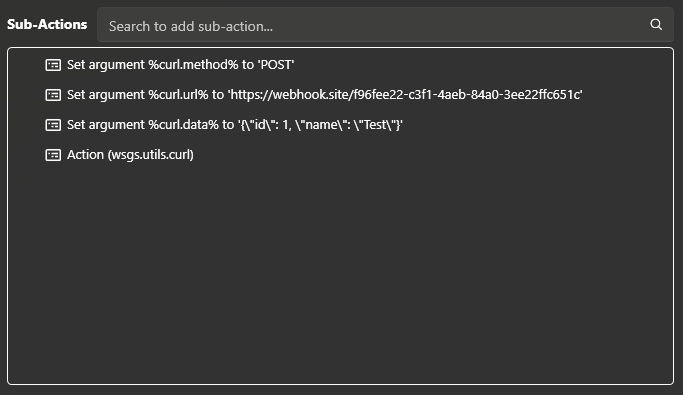

While the built-in [Fetch URL](/api/sub-actions/core/network/fetch-url) sub-action is great for making quick HTTP `GET` requests, sometimes you may need to make more complex requests, such as `POST` requests with custom headers and body content.

This utility action provides a simple way to make HTTP requests using cURL, which supports a wide range of HTTP methods and options.

::note
`curl` is now included by default on Windows 10 or later, so there is no need to install it separately.
 
This utility action will use the system `curl` executable to make HTTP requests.
::

:streamerbot-import-card{name="wsgs.utils.curl" author="whipstickgostop" expanded}

## Setup

::steps{level=3}

### Load the import code

1. Copy the import code above
1. Click **Import** at the top of Streamer.bot to open the Import Dialog
1. Paste the import code into the **Import String** field in Streamer.bot

### Confirm the Import

You should see the **Name** field populated with `wsgs.utils.curl` with a single action.

Click **Import** to add the `wsgs.utils.curl` action to your Streamer.bot instance.

::success
All selected actions will be added to your Streamer.bot installation!
::

::

## Usage

To send an HTTP request using the cURL utility action, you can use the [Set Argument](/api/sub-actions/core/arguments/set-argument) sub-action to set the necessary arguments for the request, and then execute the `wsgs.utils.curl` action by utilizing the [Run Action](/api/sub-actions/core/actions/run-action) sub-action.

### Input Arguments

::field-group

:::field{name="curl.url" type=string required}
The URL to send the request to.
:::

:::field{name="curl.method" type=string default="GET"}
The HTTP method to use, defaulting to `GET` if not specified.
  
Supported values: `GET`, `POST`, `PUT`, `DELETE`, `HEAD`, `PATCH`, `OPTIONS`
:::

:::field{name="curl.data" type=string}
Optional data to include in the request body, for methods like `POST` or `PUT`.
  
If passing JSON data, ensure it is properly stringified and escaped.
For example, `{"key":"value"}`{lang=json} would need to be passed as `{\"key\":\"value\"}`{class="text-warning"}
:::

:::field{name="curl.headers.accept" type=string}
Optional value for the `Accept` header to specify the expected response format.
  
For example, `application/json` to indicate that you expect a JSON response.
:::

:::field{name="curl.headers.authorization" type=string}
Optional value for the `Authorization` header to include credentials or tokens for authentication.
  
For example, `Bearer your_token_here` for bearer token authentication.

::::warning
If you have debug logging enabled, you can disable the logging sub-action in the `wsgs.utils.curl` action to prevent sensitive data from being logged.
::::
:::

:::field{name="curl.headers.contentType" type=string}
Optional value for the `Content-Type` header to specify the format of the request body.
  
For example, `application/json` if you are sending JSON data in the request body.
:::

:::field{name="curl.headers.userAgent" type=string}
Optional value for the `User-Agent` header to specify the client making the request.
  
For example, `MyStreamerBotClient/1.0` to identify your Streamer.bot instance in the request.
:::
::

### Output Variables

After executing the `wsgs.utils.curl` action, you can access the following output variables to get information about the response:

::field-group

:::field{name="curl.responseCode" type=number}
The HTTP status code returned by the server in response to the request.
:::

:::field{name="curl.responseBody" type=string}
The raw body of the response returned by the server, if any.

::::tip{to=/examples/parse-json-utility}
If the response is in JSON format, you can use my JSON utility to extract nested values into separate variables!
 
:icon{name=mdi:chevron-right} [Read more about `wsgs.utils.json.parse`](/examples/parse-json-utility)
::::
:::

::

## Example

For example, to make a `POST` request with a JSON body, you could set your arguments as follows:

| Argument                   | Value                                                       |
| -------------------------- | ----------------------------------------------------------- |
| `curl.method`              | `POST`                                                      |
| `curl.url`                 | `https://webhook.site/f96fee22-c3f1-4aeb-84a0-3ee22ffc651c` |
| `curl.data`                | `{\"id\": 1, \"name\": \"Test\"} `                          |
| `curl.headers.accept`      | `application/json`                                          |
| `curl.headers.contentType` | `application/json`                                          |

Then simply run the `wsgs.utils.curl` action to send the request with the specified arguments:

