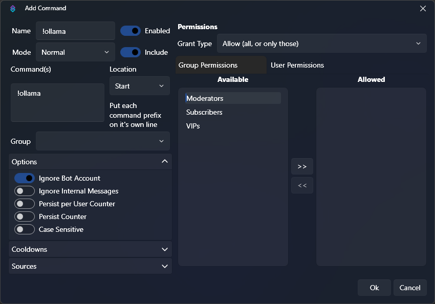
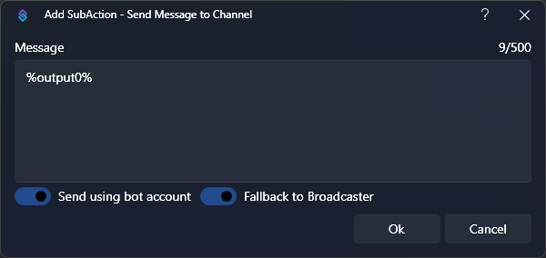
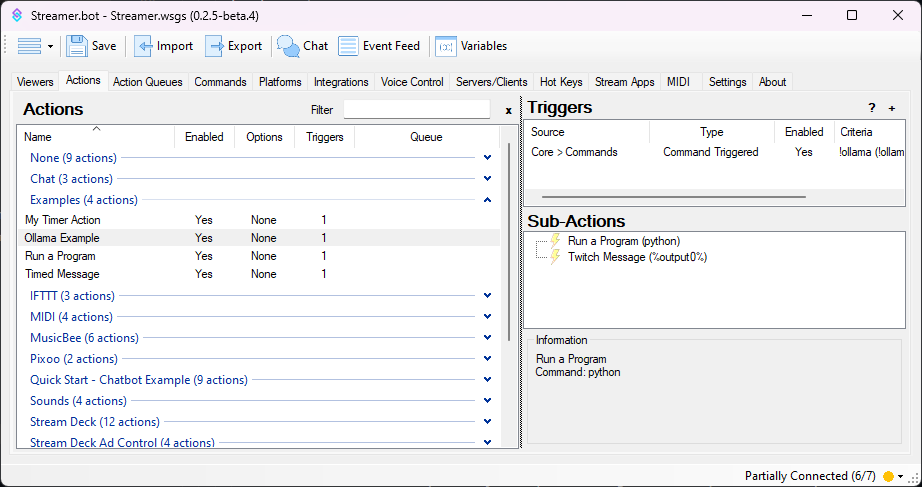

You can utilize the [Run a Program](/api/sub-actions/core/system/run-a-program) sub-action to execute scripts with Streamer.bot

:read-more{to="/api/sub-actions/core/system/run-a-program"}

::warning
**Requires Streamer.bot v0.2.5-beta.2 or later**
<br>
A bug in previous versions of Streamer.bot prevented capturing of `stdout` from scripts
::

## Prerequisites

1. Install Python

    Ensure you have the latest version of [Python 3](https://apps.microsoft.com/detail/9ncvdn91xzqp?hl=en-US&gl=US) installed on Windows

2. Add Python to $PATH

    Make sure you have added python to your PATH environment variable and you are able to execute `python` from cmd.

    If you installed Python through the Windows Store, this should be done automatically.

3. Install Ollama

    Ensure you have the latest version of [Ollama](https://ollama.com/download/windows) installed on Windows

## Instructions

1. Download llama3.1 model

    For this example, we are going to load up the latest `llama3.1` model in `ollama`:

    ```bash [Command Prompt]
    ollama run llama3.1
    ```

2. Create our Python script

    In our Streamer.bot folder, navigate to `data` and then create a `scripts` directory.

    ```python [Streamer.bot\data\scripts\ollama-example.py]
    import sys
    import ollama

    # Load the prompt from command line arguments
    prompt = " ".join(sys.argv[1:])

    # Generate text using llama3.1 model
    response = ollama.generate(model="llama3.1", prompt=prompt)

    # Print the response as a single line, truncated at 500 characters
    output = response["response"].replace("\n", " ")
    print(output[0:499])
    ```

3. Install the ollama python package

    From our `scripts` directory in Windows Explorer, :kbd{value="Right-Click"} and open the current location in terminal.

    ```bash [Command Prompt]
    pip install ollama
    ```

    This will install the ollama python package to allow our script to interact with ollama.

4. Create a Chat Command

    ::navigate
    In Streamer.bot, navigate to the **Commands** tab
    ::

    1. Set the `Name` to anything you'd like, such as `!ollama`
    2. Add a command to the `Commands` list: `!ollama`
    3. Uncheck the `Ignore Internal Messages` option
        - This will allow us to use our command from the Streamer.bot chat window!

    {caption-alt}

5. Create our Action

    ::navigate
    In Streamer.bot, navigate to the **Actions** tab
    ::

    1. Create a new action, we are going to name ours `Ollama Example`
    2. Add a Trigger, `Core > Commands > Command Triggered`
    3. Select the `!ollama` command we just created

6. Configure Sub-Actions

    1. Add a [Run a Program](/api/sub-actions/core/system/run-a-program) sub-action

        - `Core > System > Run a Program`
        - `Target`: `python`{lang=bash}
        - `Working Directory`: `path\to\Streamer.bot\data\scripts`{lang=bash}
        - `Arguments`: `ollama-example.py %rawInput%`{lang=bash}
            - Note that we are adding the `%rawInput%`{lang=cs} variable as a python argument.

                This contains the command input from the user, and will allow our python script to read it!
        - `Wait`: `1`
            - **This must be set to a value greater than 0!**

        {caption-alt}

    2. Add a [Send Message to Channel](/api/sub-actions/twitch/chat/send-message-to-channel) sub-action
        - `Twitch > Chat > Send Message to Channel`
        - Choose whether you want to send the message from your `Bot` or `Broadcaster` account
        - Set the `Message` value to `%output0%`{lang=cs}
            - This variable will contain the first line of output from our python script!

        {caption-alt}

7. Done!

    When you are finished, everything should look something like this:

    {caption-alt}

    ::success
    You can now test out the `!ollama` command in chat!
    ::

    {caption-alt}


## Import Code

Import this code into your Streamer.bot to have the command and action (mostly) set up for you!

:streamerbot-import{code="U0JBRR+LCAAAAAAABAClVsuO2zYU3QfIP7gGZhcaetpWdqk7aWfVotMmizgLPq40xEikysfYxmD+vaQetmXJRpEuxXN1eHnOvZd8ff9uNptXYPD84+zVf7hPgStwn/PfyxJXeLZ5wma2kVWFBZt/6GKwNU9S+aivT7zWhtPnQmoj62PECyjNpfAh4SJYBEeAgaaK16YDzynln1Z8oh0ibFn2WMUFr2z15cjpQY+9NRFzhgcnwA2Hdivf2pVZDzUwZ37jGBiBLAlRHmUBSmJYI7zEgIJVQMOMxHECYZ9c89s/FiwME2vWQWBSguc0ysIA2dPSMvisZPUbd+qogwvKcakHURd63+9xVZcw2LpQ0tY+pgP1AMXlDh+0026KXTnbZHVUdYRTKahVCoSZQo3iReFUP5fyQs6OpamPh0bZPAhZACmgdI0pStIcI0LCNQoJi3AchWnC8vMDnJlCgeYpTpcoSHGIkpBGKCPLGFGCgxhCFkercPSrOdRewCQIL5Gr1pzs0X2lfD9H304f3wdSjyvrhhz+RPXBdYoY5YxVYSsnuqeay8Z5BK25i/owu1N49yBqa+5Gf+6keuai+IU37Xf/cbv9Q8lC4Upvt49GgasmtSDSbLe+K7bbttv0iAfEyxfcOPv6NtoDc/NZqvs991URB9NmLdfO0TR2xjqjUZKt1oikUY5CTDLCKM4DiMfpAy+ePKubCVeMXF6u9+V/0XndMW5ZzAWDvd9sYO6HW94Z2Pv05nfSGmdAMHagVpCDaxn2iVJpm8a5ohBZLWmeMFe/a7ZGSR6nKFuyDOU0iVdRlJFwRX5EoXAE/H+Jwv9e/7/6zdqmGY4SV8e1BnaG93BH2Me3w3RA0TfN1bGtpVUURr0XXEm1BlVxY4D9rbsBNg1fOQz/oVF2HOY/tT09wE4+jOYsF81NMXGHVLJZDoZCH8fL1D4KCtjf7+uSU242uDZWwdSmpaS4uxYG9LwQUsHP0pzq+zKrNuRBGFACl1Pktb+rtdl4AlA3Irw9N6Io1vAIQnPDXyZPUZSS4HIjZcnkbnQW27BPY8db9eKuxcL81fZZcK18d0C0pM9gHkG9XJTXCdyUvBvxJ9Dwqo8/e8CcXktda7vLqZbKlad/PPgcg0W0SBFxT7VF0uY7fhU1QUkbtJy/f/f2L14ggMXgCQAA"}

You will still need to create the python script, and update the working directory of the `Run a Program` sub-action accordingly.

## Tips & Tricks

This is just a basic example, but it can be improved in many ways.

- Twitch chat messages are limited to **500 characters** or less.

    If your prompt generates more than 500 characaters worth of output, it will currently be truncated.

    The script could be modified to split output into multiple lines, for Streamer.bot to read in separately. Alternatively, Streamer.bot could be used to split the output into separate messages.

## Extended Examples

::card{title="OnlyRipper/AIExtensionOverlay" icon=i-mdi-github to="https://github.com/OnlyRipper/AIExtensionOverlay-Streamer.bot" target=_blank rel=noopener}
Take this example a step further with this overlay extension by OnlyRipper!
::