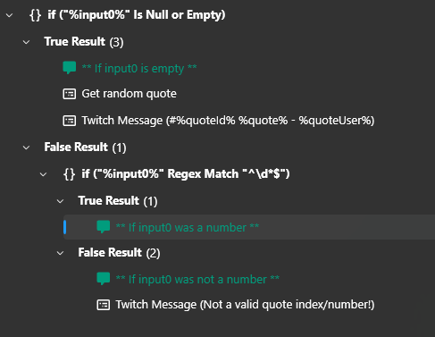
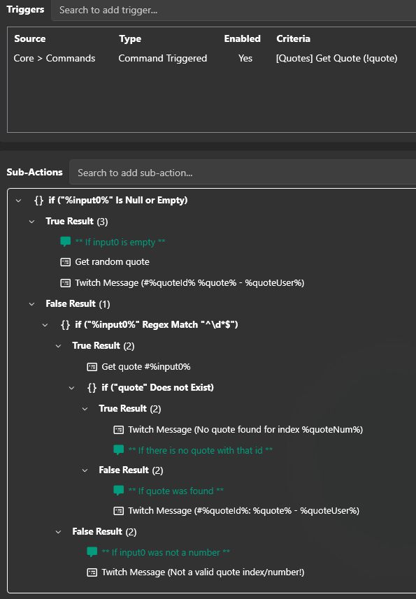
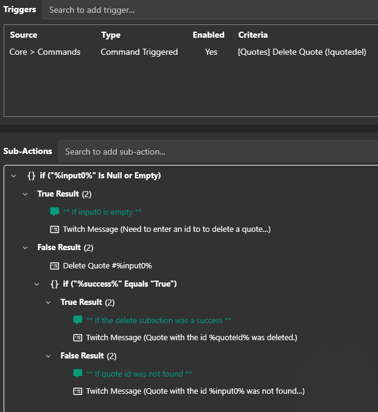

::warning
This is only for Streamer.bot v1.0.0 and above!
::

In Streamer.bot v1.0.0+, the built-in quote command "!quote" has been removed. This allows for more customization and flexibility in how quotes are retrieved and displayed. With that the "Show Quote" trigger will also not work anymore.
The following example shows how to:

- Create your own "!quote" command to either retrieve a random quote or a specific quote by its index.
- Create a "!quoteadd" command to add a quote by the input of a command.
- Create a "!quotedel" command to delete a quote by a quote index.

An import is provided at the end of the instructions, which includes a "!quote","!quoteadd" and "!quotedel" command.
Additionally the import also includes an example of how one can add a quote by directly replying to a message on Twitch and using the message you replied to as the quote itself and also the user will be linked to the quote.

The instructions below will guide you through the process of creating a quote command that can retrieve quotes, add new quotes and delete quotes.
Keep in mind this is just an example, and you can customize the sub-actions to your liking. The following sub-actions will be used to retrieve a random quote or a specific quote by its index. It will also be checked whether or not a command input is a number or not via inline math.

## Instructions (Get Quote)

1. Creating an action

    To create a new action head to the **Actions** tab and right-click in the actions section. Select **Add Action** and name it something like "Get Quote". This action will be used to retrieve a random quote or a specific quote by its index.

2. Adding the "!quote" command trigger

    Next step would be adding our trigger for the command. Right-click in the **Triggers** section and select `Core -> Commands -> Command Triggered`.
    If you already have a command like "!quote" and want to use that, you can select it from the dropdown menu. If not, you can create a new command by clicking on the `Create Command` button below the dropdown.

    Give the command a name like "Get Quote" and set the command itself to `!quote`, or anything you like.
    Leave the location to `Start`, this will allow the command to also check an input.

    The other settings can be left as is, unless you want to change them. For example, you can set the `Cooldown` to prevent spamming the command.

    

3. Check whether input is empty or not
    First we want to check whether the input, in our case the argument `input0` is empty or not. If it is empty, we will retrieve a random quote, otherwise we will try to retrieve a specific quote by the input.
    To do this, we will use an the sub-action `Core -> Logic > If/Else`.

    - In the Input field you would write `%input0%` to get the value of the input0 argument.
    - The Operation would be `Is Null or Empty`.

    After clicking `OK`, you will see a new If/Else block in your action. In the `True` group, we will retrieve a random quote, and in the `False` group we will try to retrieve a specific quote by its index.

    

4. Get a random quote and send the message

    In the `True` group of the If/Else block, we will retrieve a random quote.
    To do this, right-click on the `True Result` group and add the sub-action `Core -> Quotes -> Get Quote`.
    Or you can also click on the `True Result` group and search for the `Get Quote` sub-action in the search bar.

    In the sub-action itself make sure you select `Random` as the `Type` and click `OK`. This will retrieve a random quote from the quotes.

    Next, we want to send the quote as a message. Add the sub-action `Twitch -> Chat -> Send Message to Channel` to the `True Result` group, and make sure it's under the `Get Random Quote` sub-action.
    In the  `Message` field you can write something like `%quoteId% %quote% - %quoteUser%` to send the quote ID, the quote itself and the user who added the quote.

5. Check whether input is a number or not

    In the `False` group of the If/Else block, we will continue down the path to retrieve a specific quote by its index.

    However first we want to check whether the input is a number or not, this would still be in the `False` group. 
    
    This can be done the following way:

    1. Add another `If/Else` sub-action to check whether the `input0` value is a number or not.
        - Input: `%input0%`
        - Operation: `Regex Match`
        - Value: `^\d*$`
    
    The regex `^\d*$` is basically checking if the entire value of `input0` only consists of digits.

    In the `True` group, we will continue and try to retrieve the specific quote by its index.

    In the `False` group, you can now add another sub-action to send a message to the channel that the input is not a number, or you simply leave it empty.

    

6. Get a specific quote and send the message

    Since we have already checked that the input is a number, we can now retrieve the specific quote by its index.
    To do this we want to add the sub-action `Core -> Quotes -> Get Quote`, and as the `Type` we will select `Specific`. The `Quote ID` field will be set to `%input0%`, which will retrieve the value of the `input0` variable.
    
    :read-more{to="/api/sub-actions/core/quotes/get-quote"}
    
    The last thing we want to do is check whether or not a quote was able to be retrieved. This can be done by adding yet another `If/Else` sub-action under the `Get Quote` sub-action.

    We want to check whether the argument `quote`, or other quote related arguments were even created by the `Get Quote` sub-action.
    - Input: `quote`
    - Operation: `Does Not Exist`

    Why do we not add % around `quote`? Because we don't want the value of the `quote` argument, but rather check if the literal name `quote` exists as an argument.
    
    - In the `True` group, we can add a sub-action to send a message to the channel that the quote was not found, or you can leave it empty.
    - In the `False` group, we can add the sub-action `Twitch -> Chat -> Send Message to Channel` to send the quote as a message.
        - For example: `#%quoteId%: %quote% - %quoteUser%`
    
    

## Instructions (Add Quote)
  Adding a quote is fairly straightforward, we will create a new action that will be used to add a simple command input as the quote. The quote will be referenced to the streamer, and not the the user who added it via the command. 
  Referencing a quote to a different user when you add it requires you to use the C# methods for adding quotes.
  
  :read-more{to="/api/csharp/methods/core/quotes"}

1. Creating an action

    To create a new action head to the **Actions** tab and right-click in the actions section. Select **Add Action** and name it something like "Add Quote".

2. Adding the "!quoteadd" command trigger

    This step is pretty much the same as the previous one for just adding a !quote command. Just in this case we give it a different name and a different command itself.
    
    - Right-click in the **Triggers** section and select `Core -> Commands -> Command Triggered`.
    If you already have a command like "!quoteadd" and want to use that, you can select it from the dropdown menu. If not, you can create a new command by clicking on the `Create Command` button below the dropdown.

    Give the command a name like "Add Quote" and set the command itself to `!quoteadd`, or anything you like.
    Leave the location to `Start`, this will allow the command to also check an input.

    Potentially set the user group for this command to your Moderators only. Meaning select `Allow`, then put the `Moderator` group as the only one on the right side. (The import has it set to Moderators since adding the !quotedel command update.)

    The other settings can be left as is, unless you want to change them. For example, you can set the `Cooldown` to prevent spamming the command.

3. Check if the rawInput of the command is empty or not

    First we want to check whether the rawInput that was given is not just empty, so we don't add empty quotes. 
    To do this, we will use the sub-action `Core -> Logic -> If/Else`.
    - Input: `%rawInput%`
    - Operation: `Is Null or Empty`
    
    In the `True` group, we can then add a `Break` sub-action to stop the action from continuing, since the rawInput was empty.
    We can leave the `False` group empty and basically just continue after the `If/Else`block.

4. Adding the quote itself

    Next, we want to add the quote itself. To do this, we will use the sub-action `Core -> Quotes -> Add Quote`.
    
    In the `Variable` field, we will write `%rawInput%`, this will get the whole input of the command, so the value of `rawInput`.

    

5. Check if the quote was added successfully

    After adding the quote, we want to check whether or not the quote was added successfully. This can be done by adding another `If/Else` sub-action.
    - Input: `%success%`
    - Operation: `Equals`
    - Value: `True`

    In the `False` group, we can then add a `Break` sub-action to stop the action from continuing, since the quote was not added successfully.
    
    Below the whole `If/Else` block, you can also put this in the `True` group`, we can then add a sub-action to send a message to the channel that the quote was added successfully.

    So create a sub-action `Twitch -> Chat -> Send Message to Channel` and write something like `Quote added successfully! ID: %quoteId% - %quote%` in the `Message` field.

## Instructions (Delete Quote)
  Deleting a quote is similiar to `Get Quote` as we again check if the input is a number and then try to delete by that index/number.

1. Creating an action

    To create a new action head to the **Actions** tab and right-click in the actions section. Select **Add Action** and name it something like "Delete Quote".

2. Adding the "!quotedel" command trigger
    
    - Right-click in the **Triggers** section and select `Core -> Commands -> Command Triggered`.
    If you already have a command like "!quotedel" and want to use that, you can select it from the dropdown menu. If not, you can create a new command by clicking on the `Create Command` button below the dropdown.

    Give the command a name like "Delete Quote" and set the command itself to `!quotedel`, or anything you like.
    Leave the location to `Start`, this will allow the command to also check an input.

    Potentially set the user group for this command to your Moderators only. Meaning select `Allow`, then put the `Moderator` group as the only one on the right side.
    The other settings can be left as is, unless you want to change them.

3. Check whether input is empty or not
    First we want to check whether the input, in our case the argument `input0` is empty or not. If it is empty, we will retrieve a random quote, otherwise we will try to retrieve a specific quote by the input.
    To do this, we will use an the sub-action `Core -> Logic > If/Else`.

    - In the Input field you would write `%input0%` to get the value of the input0 argument.
    - The Operation would be `Is Null or Empty`.

    After clicking `OK`, you will see a new If/Else block in your action. In the `True` group, we send a message that there needs to be an number input.
    
    In the `False` group we will try to delete a specific quote by its index.
    
    

4. Delete Quote

    In the `False` group of the If/Else block, we will try and delete the quote by the value of `input0`.

    Add the sub-action `Core -> Quotes > Delete Quote` and write `%input0%` in the field.
    We don't need to check whether the value of `input0` is a number or not as the Delete Quote just checks if the input is an existing id and if not it will not be able to delete the id.

    You can add a check like in the `Get Quote` action if you want but not directly necessary.
    

5. Check whether the quote was actually deleted by the input

    Now we want to check whether a quote was successfully deleted or not. 
    
    This can be done the following way:

    1. Add another `If/Else` sub-action to check whether the `success` value is `True`.
        - Input: `%success%`
        - Operation: `Equals`
        - Value: `True`

    In the `True` group, we can then write a message like `Quote with the id %quoteId% was deleted.`

    In the `False` group, we can send a message for when the `%input0%` was not an existing quote id.

    

## Import

As mentioned at the start here is the import for Streamer.bot v1.0.0 and above. This includes the `!quote`, `!quoteadd` and `!quotedel`  commands, and the needed actions. Additionaly an example how to use a Twitch Reply to add a quote, which is not linked to any trigger as it's just an example.

```bash [streamerbot-import]
U0JBRR+LCAAAAAAABADtXelzGzey/75V+z9wtS/1rsDBfeSbrSSylMRZS7LkVeRXhVNizCs8dGQr//vrGZIjUsPhZVKH11Mul0g0MEB3A/3rRgP811//UqvtNGPf7nxb+1f2AT62bDPCx51f3w7a/dj7UNuL/W9ehvDNd7ER+7Fma3nBztcjejvoX7a7WY2jfjdC5e4L1+7XUK1z3bq9LciuYrdXb7cyOvICvyBFQYg93613+qNCeFuta1uh3ay1u7VeJ/p6qvva79k7v67ZEKAD+YcaENXCsE/DLxJUmOpD9iL8v5M9bR8OWi/96F2tQaMxLmvWW/XmoHlS9DIrzMr+zCl2gp1iks3b6ME3vw6/qY2L8uJ6yMfpsUg0JmRkCIhjHJGWTiDOTWIkcBK1H3cur/b7IA5y3uPRg2b8N36masaWdY2YvbXfHcSpkhvfGIT4Q7fdfF3v9dvdWyBKttGrovpHbIV662IWVUk1XubimNKHnPCi2x50MsohYe3oVe0qF8YUlW1c29seSGTWu4Y6UMiqVO7bLT/odmOrP6u0361fXIAsJwV0T0ijVppNeNF+Li/JJbPScaSx54jHYJBVRiBDgjEEyjDWkwOYEDUPwmDrMWJaY8Q95shKTVAkjBqaUtLWlqr2bzsZOzkm90sqxXknrN5Y/z5Mlv559+HDJD96A/eyrLKzOHJlG0Md/BXVdi+j/1irp1r/MsKkvN5vdQb9Wk5Rq/dqsdnp336dld+CjEG3OjnhcG7k37faNZBTv96CCuhDiQG+3RiuHBVcBRZizxRByhKHuCQK6eAIItzFyKXg0cZS1etYv7jMlALUrYLjBGNzv6hjM13KFWFiXVhSIvVWiDfZK6dk8fU8PtczXmaD/GrM2K9KQ2l3YteOJkCpw2NBzeptttIdD8c6q7vV2jCjp3mN4WycMdOWbLOi3SEnclkrq7RXmCFCPAFZK4qMdhpFHpKSSWrOwn0GFU3MkXlBM5Y95VUUEyqwQ21ghCSDWMQUcUoxMsZTFLUigVFhZ0zooqG5ynI37llKM37+LH/5YRbb65/U20WMGzPNGFNapO6zbIYeLseMakb8WaLehG7O4aPnGNYXkhCs3QlxgQ0yApgZNVNJU8aJ8Z/KR7p1PpISH6e/uM+A0eAlk1Z4YpDX3iOeqEaOKoWoUNjIFK1Vcq3VlpZKNrLYTg1z/mKb48MT261n7S5YdIfMSE4TJjUYHGZgOcIA4MCy20wTDNXGa7A965keprbCDbqO6ekNvI+93nzLUxpKARGOoT+lqo9ue+bMb05lcjIClggWELnTHDkdIrJJKJOEtox8WSfXt+GWRKdx8ICCBaDgZDCyAlC0DCIGawBc84e04SFElkKSyHMHIqfgellCBCKR0JCos4KZp2PD1+3tZ2F7AnaGGxpgJmoGDnKUSFMKEzNKYVNy0Qv3lGwPW361nXSoXnYvBk14e+/bYcjiuN6MXw//3A+jP971Ynfiz/3SjFnoNknrFFGSIUlSBBQTAA3KKBBVnqqQOBOWPim3ia/BzZxB/2jYfmp3myN+7dmCneu4m0ZiJZg1KFLHMhMBM9BQj6IFzyR5oznFT4pvYnm+9eNNvwjIZGG0GL6tfZWzqmz9B734qt2veDlYj4az/mNV34as9I7JPPTlFGBJrR1gSVBBy4kzWnm7tgpuhZFyipF3H6ZiKKA+DdvpxbCXRbemYy93zC+HAbEnzlvikQkYnAppLLJKOaQSBp0iWieRnncYMIvZfi5BQOq854oxpJQCDEOlBheAJoSZCZoJFkMUFesH88ZxpTjyXigwYh4cKMYzV1wyBUuysK68mD/JIOCdh5D/hbcTmpqFQ59YbKowN/upNmRFEfisRI6Fmfk7JmZXfVdJONIaGY21YHW0sOBphuSRE8EinFLyTEiBDd8IaC5boYJkKvKlqAyAFJClloOPxDQynIC3xLj2SVHKFNkqap5Zq0pAQxg1HGElB0YAqxrgDns1Ak/ES2ZBCNpKxI23CHx9D/NfJh6cJYpUD381cVSSPJI4Stg9e1YTxxhm/P2rEc+/GoOMGhr9lYHa0npSNDAPehRE8yHI3biGroV1ID8RUGJcgPmVChmsAyIiBCU4SSSlzQj0iYmTzhTnSj7pur39Ei+pbnfUtQUGtqCcNLSsiqgwU/93fh7+5z8qG1tgfFcY2JzB5S0sZN6K71rwvrylSVswS6vKxMM5uUgGRZ0RnrdJGMUoYizbzPdGIk0EwHtCknaK6hRLcfJSU0ssLAXtYotRkE6FvwTDBuOAKMt21BihyBEJNk3Z4LB3QbmSO1tqcKklp6Cea9jHz2yLMn4WCbmYOb/fdzhmkk9OH7mIeA5uLdEuOZUK+uXVPHsWcCFvcekptmYfluxH3vLY7r9pF7k4g1bIM3JynRjZ/jeD5sJZVrS5DBQoVVoOGpSqDWe2jlo5AzPGOgcOnHRg7sD5Q1QElSRgiJhKUcjKJleY4UWdRVCiVGFyvvsAjqt0EpmIGeKW+SzdCCPiosgCPhJXR99LDa8074taS83/8TN/HRg/y2rgpKfWv4zdPEOlNVbH63r/Er62/Vp9eR4s68iVKo63EJN0VkhEjAHIJFhEWlODiMUBCxy5cpVQr9TkJ2lTpeNXqvJE9WmmZ3L/mQFt7z+zoG75pRsd/aqSWwSNS/SLoXKpysrCWH5iL57Uz820TS4so8XE9ob27aFWEoy1o8RaAJs+iyAr0EqrBFKJBuY0/F9OTKxs8hFWEhaiZzIQpFPI7KpnSHutssRKjXWSjMvP2DKVYyLfrhYUKbX48MhICG6VlRhJnsCDwCLLihUYKVikooIvLX0gW/bM9e8RLNmmRv8plmxW4kGJ/kEt2UJBLBDCIgGMYYTg3jDuEA0Glm7NDNIRa5S00pZzhxVdyPy1ggWlxIcS5ROJFcwVxBwhzBPAOPT7iaNalvHLYrYVNHx5Zi42bdXm7KlF8GZst2Vgq9Xu1yxwrOlid6EWroq1xod1nGMsZGoiMgsnwGXThBOkdBKOpECTqNyGK5paL6q3CFNNzdQUPLZUc0Spgs4mq5G24Jc4JpQMgWql2POL6t3FjzJJgxrUwwhs5y//Zij7vy0c2CrIaEVEND6nQHyUxuJsV9BkfiEgIYstAt7r6GIQnm1JT56JlmxxPf/UUa2zns9DLttdzysZWcHEKgaOF7jArCSJIhZjhkRgbbOeAISPJBEWBY6h0hiulpy71EZolNxRDJhIE+NgHmXbssR4FAyXXBoTDancRdnIvnb5yzkboev29vNIzg0kYWINUj7ZLK3bIRMDRUR77iJ3sPyVMpMfMzl3+hTe3YeNZPPFzGkKSSOajEDcxIic4ga5kHByWnAqpjIbn18238Sh3tpV3dYOY6dxW/uv4+t631/+99NN8dvAgdfjy3pvdH412z6wrVq8sc1OI9baqXbZvq7121NH0N1trZtxB1ibF9WGTKo1Y69nL9ZKQobVmNPEFZKaw2SzHLx1DSaPcJYCIQBR6dNK3l7hzOskq9+0a8dD4eWczhKSM3aGmOygASCwV6v3/7NX+23Q60/KYQ2OKkKygxQS0eg1zFiXp8NLRIRTwGvtNC0f635Mjq5wsG0ij6SXz9PP6yjXLMO9MFUTlOv0Mrbys+ij1N5cxYZTdThPxxMU/IXhtuC9iV1Ws+I9lepWUIyPtEgbg6QoGooR51IjQ4VASnhNBNcy8Mqg/TbyOkHXGafBAuALWS4XIcgIK7Lz1kFL4SQR1fjvwfM6R1ZpXr7m9MUh8yi7MUVghI9zAxQ7u9+en5/CGNrXvfPzn+u+2+61U//Fm++Pz89/6EKHrtvdj5Kfn19xsHEMM2LOz5s93+426u5FaDR2VgTm7rYfd9sh19rw/k3HNf3FO9b4I+yd9H+5xj9+97ZzHU4Pevb054t/0ptLz36+eEte7R+dCvhONKBcffe2feBfn9TdXuO3/b2DK0evLw7fXzb+yU7w2dFFJyuP0Nbu28Z3776/GJy8PhCH9AS/fX/Q+nH34Pbs/atePBLE05Pbo9O39Z/2DAm7r/4Irw/y/vjmybV73TgZlXd+WbKt4z3Tsqd8bnvHzR/6Z0cf8zHsvnvz9mhXvPOtxuuz94evfNO391sHDb93I35qnfxx9v7gl3+eksZ+/eYqvH974dnhLfCgtf96SHPy/k3D15doq0n+OMMHV2evP5b79v7kKuy96wx5D+2cAn7afQVlh424+9Lsf5+3++ps7/AwnBp89u7syjcOmX1/+JvdvRyO/yTv68HZ7s1NTnN0g33rpPHjce/N7sXHg0x+PzXeNML3P9yesZP+2akAhh6MaPd7k30Y8/ndiMcBxu9ab2EsPxDHDhtDeTUGZ3snfKn2877t13+q5tnxkF+BuNMTGPtFfdifkwl5QR/ny3BuG3mfJ9//sfFx2Pd8vMDDQ+Kb/AJkQs7y7xsG9Lz6oGanG2GV79QbC7MaQ2zY26O+7c6CklOUPXsVD2MPgMhxe+LY+MI6U9RL5Jpr4blhEjEdAesxJZEFNxxhFrRyUgbrK/ONVjERJnuemI3YYLL51Jm2X4td1g/FLivgykfKPQc5cqcTwvlhIhccstRYFFwEFJAUZdUJZZvPPX9A6W4g93zd3n7JPa9uN69ZAspvfjku0PEQEMfCDwPPfQvYWHsnozcaXNuQbcdJjqzC4JwFoZxmyjNdGcjdypmnZLGxJqCgDfSHSIIcdxJJJj12wkir1NPBxivcZnL3+uH9F8ZTrxRDLAgKPglLMKdAAlgTGrzU4Atv6CxM6ZaTguSR+P5vYW9M5DCPHEykSBjiImKwNzILelDrPFUANqqB1ObPOj2cdDdx1mnN3n4WIX5wJ2hQjiEvGaiLUDB4kRiiXhtHWbBKlAb/mCH+6duO7j5sJMSvpA4i+QgsIIA8CGBzmDcWySSi0lFL+dxD/KOrXD+XM/vSgl3jFKMAoDDbFwaYbZhCQYlAmabU2xKcGMvaUMIYpSDh7M4PajzSFAC7sjZIGyWRpnzc/8uZ/enyJxoI3t6ZfcyTJ1E7hEMW22XJIkeyW5u0tcRgUEWyIRy1HH4NGEvPsqtqEqPZTcMWaRxjdtkIpiYRH9MTiu0WyT4xhsy5gGHEbrbJU88/wr8wvmo6R1EvHhBB4aSU0SIgwhTNcJMHhKw4cpJSKyMFgPCAp8UfUK4bSJJYt7eb9Nh3nEvCJkpQlJxkaS4MaRk0ssFrLqkmhMzcdnnePv0Kp5nH+8ycR5td76kSWEouqEWWYYWI896Ab05S2tA9F6zq3O2U3AiATEYVTDeXXZ4DQkSZU4pc9NnVd445Xdr3Lhp68CVs8RWaBem8/deCaO4+bEE1fz+2IHuep/fvHeAc2wB4wSghI8sEtrURv7eVBsxpyO7K87D0Z46QZwk55ROKVHtwBK3g1Stu0dRDpAEDZgXHLCEcs8OlTuQ5WQR5ogXMIsmSf4aH+6cjLKNDuzHDBXf3yWRqMNSNUAkMiga3nw9MqBCECY6Y99lPOwiBHIYVDPwRYoITWJVvriw1tf184MdTl23mA3/iqLZ5vmNHU4UDIBFkYOkAz9JbZGx2KacnsCKlRHWceZd40di//QmQ0QGAUJwBWerQ7borP4gkZsdsQV4O5BWNQg7EjUCPFHbKROK3da3LSiu/UyzppCXyCTSfKxuR9jahgBXolwlWlBMESw0+p5V/hGenteApLP2gHkkkkUFoCcsPwRFZ7jCiMjIRfDLSV8a3i6a2vvQ/or5scen/1FFt8yjIYyz9Gz4s8ikj2MJhkQd0DjcQB1m3t5vcSXqIOMiae03r9Ox5HycZ/jGmH24XTR1ZGG9nVP6gXCd2m/U+uDzZjnL5tENRfPf2yU7v/NwOWRCiDVUr+j9KSFvxF9CW/0W4O1aXtnzqrXwPa1ZRc5gci6c5nbMqe+vfcoRowxQm3OnGi3jz/U2nUff1/q7t9AfdmY032n5WXGanftFqdzPs8NJ7gBozIMSIZD+LW7dsYwZBrz3oDtONyT059eq9/m7WbOzO6tSIIhPzHCpve/Eotnr1fv1q5tguGm1nG7vtdiO0r0sjHOStzy67twN4b3fQtvrjy3YL7f56Mwo7Qx1XvYt72ZvJt6iMXzTx+WviekvninvQK2zKb1FdQ2x80dhH1Nh7yOA6ul7bf4z9o9i9uqetd4W7jXr2GzJThf16c0yffTP61dq7H92lw7uDd+JNp90FuWcZIzlWvfst3vJv4OalGNlG59IC1V//8uf/A19/VxwyeAAA
```