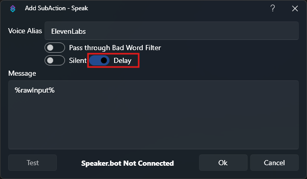

Since Streamer.bot v.0.2.3 you are able to use the new `Speaker.bot -> Speak` subaction. This requires a websocket connection. Navigate to `Settings -> Websocket Server` in **Speaker.bot** and start the server. In **Streamer.bot** then go to `Integrations -> Speaker.bot` and connect it there. You can then check *Delay* on the subaction and the upcoming subactions will wait until TTS has finished. Checking the *Delay* box also populates the `%duration%` variable (ms).

