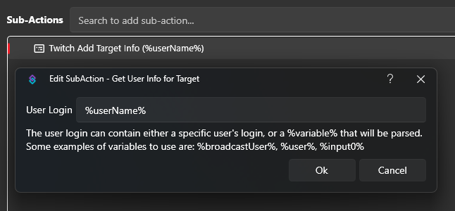

Those variables are being populated by the *Get User Info For Target* subaction (`Twitch -> User`). The `User Login` field can either be a plain username or you use variables. If it's the redeemer, it'd be `%userName%`, if it was a targeted user from a command like `!hug nate1280`, you'd want to type `%input0%` in there. So it can be **any** variable, but it obviously depends what trigger you are using.

